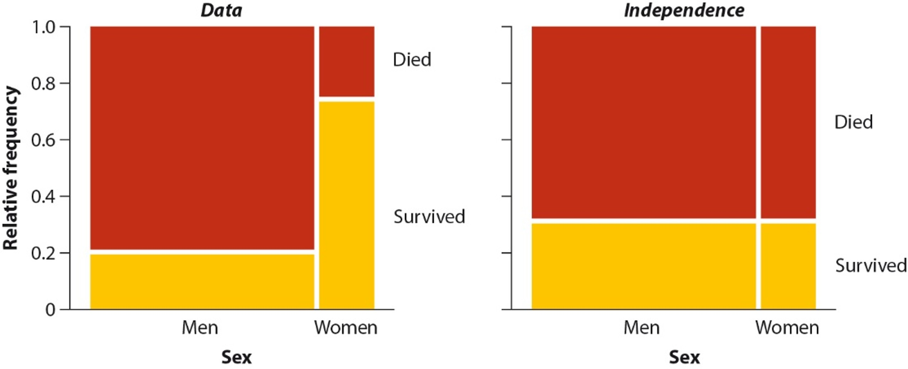
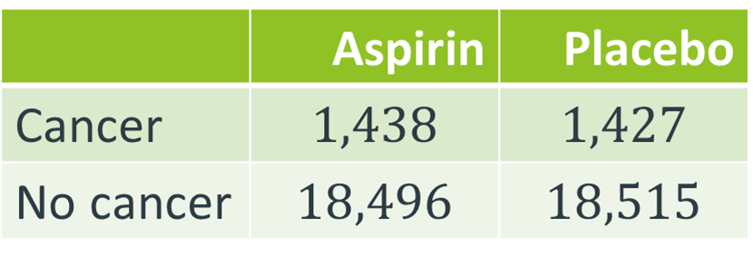
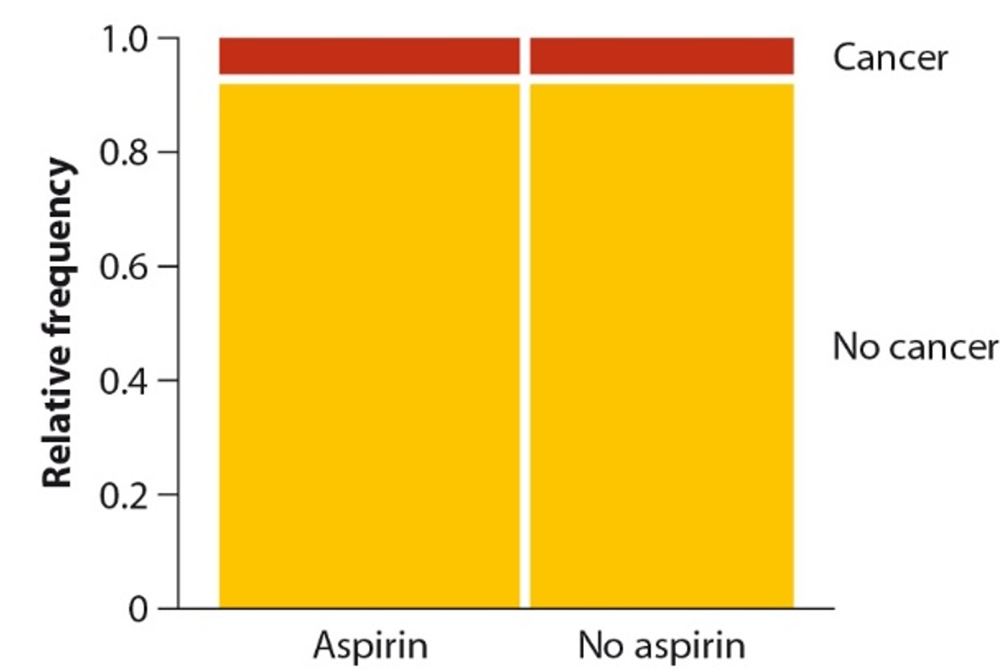
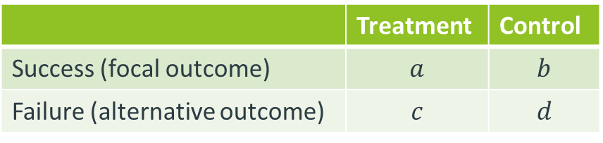
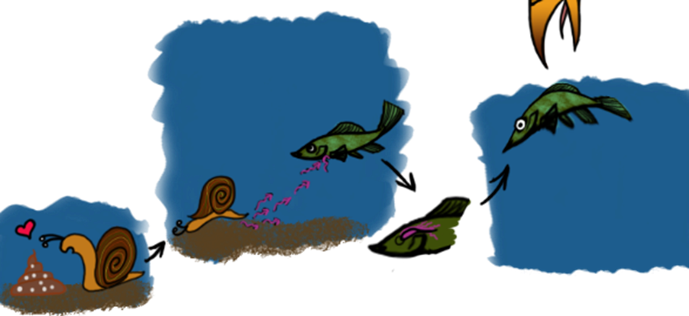
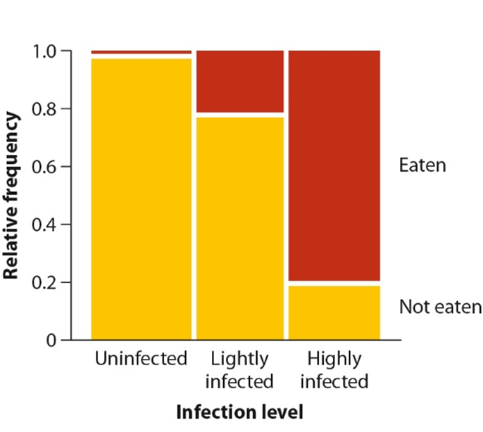
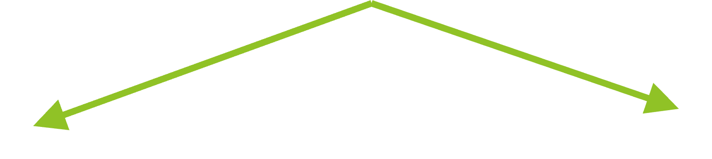
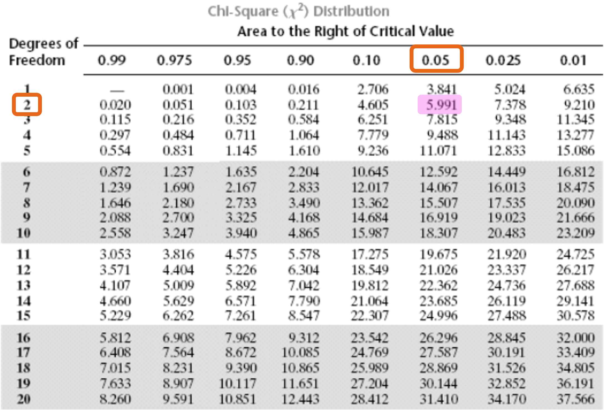

## Learning Objectives

-   Construct and interpret contingency tables.
-   Compute and interpret risk, relative risk (RR), odds, and odds ratio
    (OR).
-   Select RR vs. OR based on study design (cohort vs. case-control).
-   State and test hypotheses of independence using the chi-square test.
-   Calculate expected counts and the chi-square statistic.
-   Make decisions using $P$-values or critical values.
-   Identify when alternative tests (e.g., Fisher’s exact test) are
    appropriate.

## Contingency Analysis: Relationships Between Categorical Variables

-   We now move from **one categorical variable** to **two categorical
    variables**

**Examples:**

\- Treatment (Aspirin vs Placebo) × Cancer (Yes/No)\
- Sex (Men/Women) × Survival (Yes/No)\
- Smoking (Yes/No) × Lung Disease (Yes/No)

**Core Question:**

> Does the distribution of one variable depend on the other?

If yes → **association**\
If no → **independence**

## Example: Does knowing a person’s sex tell you anything about the chance they survived the Titanic?



## Two Complementary Goals

::::: columns
::: {.column width="50%"}
### 1️⃣ Estimation

How strong is the relationship?

-   Relative Risk (RR)
-   Odds Ratio (OR)

These quantify the **magnitude** of association.
:::

::: {.column width="50%"}
### 2️⃣ Hypothesis Testing

Is the relationship statistically detectable?

-   Chi-square contingency test

This evaluates **evidence** for association.
:::
:::::

**Important:**\
Estimation and testing answer different questions.

## Two-Part Framework for Contingency Analysis

::::: columns
::: {.column width="50%"}
### Part 1: Estimation

-   Construct a 2×2 contingency table
-   Compute:
    -   Risk
    -   Relative Risk (RR)
    -   Odds
    -   Odds Ratio (OR)
-   Interpret effect size

We quantify **how much** the variables are associated.
:::

::: {.column width="50%"}
### Part 2: Hypothesis Testing

-   Null hypothesis: variables are independent
-   Expected counts under independence
-   Chi-square contingency test
-   Good for more than 2x2 contingency tables

We determine **whether** the observed association could be due to
chance.
:::
:::::

## What is a Contingency Table?

::::: columns
::: {.column width="50%"}
-   A [contingency table]{.keyword} summarizes the joint distribution of
    two categorical variables
-   Rows = categories of one variable
-   Columns = categories of the second variable
-   Each cell = a **count (frequency)**
-   Margins show row and column totals
-   Allows us to:
    -   Compare conditional proportions
    -   Assess association vs independence
    -   Compute relative risk and odds ratios
:::

::: {.column width="50%"}
```{r}
#| label: fig-contingency-table
#| fig-cap: "Summary of the Titanic data from Whitlock & Schluter"

library(gt)

titanic_path <- "http://www.zoology.ubc.ca/~schluter/WhitlockSchluter/wp-content/data/chapter09/chap09f1.1Titanic.csv"

titanic_path |> 
  readr::read_csv(show_col_types = FALSE) |> 
  dplyr::mutate(
    sex = factor(sex, levels = c("Men", "Women")),
    survival = factor(survival, levels = c("Survived", "Died"))
  ) |> 
  dplyr::count(sex, survival) |> 
  tidyr::pivot_wider(
    names_from = "sex",
    values_from = n
  ) |> 
  dplyr::mutate(Total = Men + Women) |> 
  gt(rowname_col = "survival") |> 
  tab_stubhead(label = "Survival") |> 
  tab_spanner(label = "Sex", columns = c(Men, Women))|> 
  cols_label(Total = "") |> 
  grand_summary_rows(
    columns = everything(),
    fns = list(label = "", fn = "sum")
  ) |>
  cols_align(
    align = "center",
    columns = c(Men, Women)
  ) |> 
  # Color the stub (row labels) as one block color
  tab_style(
    style = cell_fill(color = "#56B4E9"),
    locations = list(
      cells_stub(rows = everything()),
      cells_stubhead()
    )
  ) |>
  
  # Color the column spanner + column labels as one block color
  tab_style(
    style = cell_fill(color = "#E69F00"),
    locations = list(
      cells_column_spanners(),
      cells_column_labels(columns = c(Men, Women))
    )
  ) |> 
  tab_options(
    table.width = pct(60),
    table.font.size = px(40),
    table.border.top.width = px(0),
    table.border.bottom.width = px(0),
    column_labels.border.top.width = px(0),
    column_labels.border.bottom.width = px(0),
    table_body.border.bottom.width = px(0),
    table_body.border.top.width = px(0),
    data_row.padding = px(16),
    data_row.padding.horizontal = px(16),
    column_labels.padding = px(8),
    column_labels.padding.horizontal = px(16)
  )|>
  tab_style(
    style = cell_borders(sides = "all", weight = px(0)),
    locations = list(
      cells_body(rows = everything()),
      cells_stub(rows = everything()),
      cells_grand_summary(),
      cells_stub_grand_summary(),
      cells_footnotes(),
      cells_source_notes(),
      cells_column_labels(),
      cells_column_spanners()
    )
  ) |> 
  tab_style(
    style = cell_borders(sides = "left", weight = px(3), color = "black"),
    locations = list(
      cells_stub(),
      cells_stubhead()
    )
  ) |> 
  tab_style(
    style = cell_borders(sides = "right", weight = px(3), color = "black"),
    locations = list(
      cells_column_spanners(),
      cells_column_labels(columns = "Women"),
      cells_body(columns = "Women"),
      cells_stub(),
      cells_stubhead()
    )
  ) |> 
  tab_style(
    style = cell_borders(sides = "bottom", weight = px(3), color = "black"),
    locations = list(
      cells_body(columns = c("Men", "Women"), rows = 2),
      cells_stub(rows = 2)
    )
  ) |> 
  tab_style(
    style = cell_borders(sides = "top", weight = px(3), color = "black"),
    locations = list(
      cells_column_spanners(),
      cells_stubhead(),
      cells_body(columns = c("Men", "Women"), rows = 1)
    )
  ) |> 
  tab_style(
    style = cell_borders(sides = "top", weight = px(1.5), color = "gray70"),
    locations = list(
      cells_stub(rows = 1)
    )
  )

```
:::
:::::

## Example Study: Aspirin and Cancer Risk

::::: columns
::: {.column width="50%"}
A large randomized study investigated whether regular aspirin use
reduces cancer risk.

Two categorical variables:

-   **Treatment**: (Aspirin vs. Placebo)
-   **Cancer Outcome**: Cancer, No Cancer

Each participant falls into exactly one cell of a 2 × 2 contingency
table.

Our goal:

> Does cancer risk differ between the aspirin and placebo groups?
:::

::: {.column width="50%"}
{fig-align="center"
width="500"}

{fig-align="center"
width="500"}
:::
:::::

## Conditional Probability ([Risk]{.keyword})

A **risk** is a conditional probability:

$$
\text{Risk} = \operatorname{Pr}(\text{Cancer} \mid \text{Group})
$$

We compute risk as a proportion by dividing:

$$ p=\frac{\text{number with cancer in group}}{\text{total in group}} $$

## Example: Risk of Cancer for each Group

{fig-align="center"
width="40%"}

::::: columns
::: {.column width="50%"}
Risk of cancer in the aspirin group:

$$
\operatorname{Pr}(\text{Cancer} \mid \text{Aspirin}) 
$$

$$
\hat{p}_1=\frac{1438}{1438+18496}=0.0721
$$
:::

::: {.column width="50%"}
Risk of cancer in the placebo group:

$$  
\operatorname{Pr}(\text{Cancer} \mid \text{Placebo}) 
$$

$$
\hat{p}_2=\frac{1427}{1427+18515}=0.0716
$$
:::
:::::

## [Relative Risk]{.keyword} (RR)

::::: columns
::: {.column width="50%"}
Now we compare risks across groups.

Relative risk of aspirin:

$$ RR =  \frac{ \operatorname{Pr}(\text{Cancer} \mid \text{Aspirin}) }{ \operatorname{Pr}(\text{Cancer} \mid \text{Placebo}) } $$

$$ \hat{RR}=\frac{\hat{p}_1}{\hat{p}_2} $$

$$ =\frac{0.0721}{0.0716}=1.007 $$
:::

::: {.column width="50%"}
Interpretation:

-   $RR = 1$ → same risk in both groups
-   $RR > 1$ → higher risk in aspirin group
-   $RR < 1$ → lower risk in aspirin group

Relative risk measures the **magnitude of association** between
treatment and outcome.
:::
:::::

## Odds: A Different Way to Express Probability

::::: columns
::: column
-   Risk compares outcome to total.

-   Odds compare outcome to non-outcome.

-   Odds are not bounded between 0 and 1.

-   When to use: 2 variables, each with 2 categories
:::

::: column
Risk (probability):

$$
\operatorname{Pr}(\text{Cancer})
$$

Odds:

$$
\frac{\operatorname{Pr}(\text{Cancer})}
     {\operatorname{Pr}(\text{No Cancer})}
$$

$$
=\frac{\operatorname{Pr}(\text{Cancer})}     {1 - \operatorname{Pr}(\text{Cancer})}
$$
:::
:::::

## Odds of developing cancer while taking aspirin

::::: columns
::: {.column width="50%"}
{fig-align="center"}
:::

::: {.column width="50%"}
Success

$$
\hat{p}_1=\frac{1438}{1438+18496}=0.0721
$$

Failure

$$
1-\hat{p}_1=1-0.0721=0.9279
$$

Odds of success

$$
\hat{O}_1=\frac{\hat{p}_1}{1-\hat{p}_1}=\frac{0.0721}{0.9279}=0.0777
$$
:::
:::::

## Odds of developing cancer while taking placebo

::::: columns
::: {.column width="50%"}
{fig-align="center"}
:::

::: {.column width="50%"}
Success

$$
\hat{p}_2=\frac{1427}{1427+18515}=0.0716
$$

Failure

$$
1-\hat{p}_2=1-0.0716=0.9274
$$

Odds of success

$$
\hat{O}_2=\frac{\hat{p}_2}{1-\hat{p}_2}=\frac{0.0721}{0.9284}=0.0771
$$
:::
:::::

## [Odds Ratio]{.keyword} (OR)

::::: columns
::: {.column width="50%"}
The odds ratio compares two odds:

$$ \hat{OR} = \frac{\text{Odds}(\text{Cancer} \mid \text{Aspirin})}      {\text{Odds}(\text{Cancer} \mid \text{Placebo})} $$

Interpretation:

-   $OR = 1$ → same odds in both groups
-   $OR > 1$ → higher odds in numerator group
-   $OR < 1$ → lower odds in numerator group
:::

::: {.column width="50%"}
For the aspirin study:

$$
\hat{OR}
=
\frac{0.0777}{0.0771}
=
1.008
$$

The odds of cancer are essentially the same in the aspirin and placebo
groups.
:::
:::::

## Odds ratio shortcut

The following is a shortcut formula where 𝑎, 𝑏, 𝑐, and 𝑑 refer to the
observed frequencies in the cells of the contingency table:

$$
\hat{OR}=\frac{a/c}{b/d}=\frac{ad}{bc}
$$

{fig-align="center"}

## Standard error for odds ratio

-   The sampling distribution for the odds ratio is highly skewed, so we
    convert the odds ratio to its natural log,
    $\operatorname{ln}(\hat{OR})$

$$
\operatorname{SE}[\operatorname{ln}(\hat{OR})]=\sqrt{\frac{1}{a}+\frac{1}{b}+\frac{1}{c}+\frac{1}{d}}
$$

-   This is called the standard error of the log-odds ratio

For the aspirin example:

$$
\operatorname{SE}[\operatorname{ln}(\hat{OR})]=\sqrt{\frac{1}{1438}+\frac{1}{1427}+\frac{1}{18496}+\frac{1}{18515}}=0.03878
$$

## Confidence interval for odds ratio

-   We can approximate a confidence interval for the log-odds ratio:

$$
\operatorname{ln}(\hat{OR}) \pm Z \times \operatorname{SE}[\operatorname{ln}(\hat{OR})]
$$

where $Z=1.96$ for a 95% CI and $Z=2.58$ for a 99% CI

To get the CI for the odds ratio itself, you have to take the antilog of
the upper and lower bounds:

$$
e^x < \operatorname{OR} < e^y
$$

## Odds ratio interpretation

-   If OR=1 there is no association between exposure and outcome

-   If 95% CI includes 1, results are not statistically significant

## Relative Risk vs. Odds Ratio

::::: columns
::: column
**Relative Risk (RR)**

-   Requires estimating **risk (probability)**
-   Risk requires a meaningful **numerator and denominator**:
    -   number with outcome
    -   total number at risk

Best used when

-   Cohort studies
-   Randomized experiments
-   The total population at risk is known
:::

::: column
**Odds Ratio (OR)**

-   Does not require estimating population risk
-   Can be computed even when totals at risk are unknown

Best used when

-   Case-control studies
-   Logistic regression

If the outcome is rare, $OR \approx RR$
:::
:::::

## [Case-Control Study]{.keyword}

::::: columns
::: {.column width="50%"}
-   Investigates associations between an exposure and an outcome.

-   Start with individuals who already have the outcome (**cases**)

-   Select a comparison group without the outcome (**controls**)

-   Look backward to determine prior exposure status

-   The total population at risk is unknown, so risk cannot be estimated
    directly. Use **odds ratio** instead.
:::

::: {.column width="50%"}
](images/clipboard-3885282623.png)
:::
:::::

## [Cohort Study]{.keyword}

::::: columns
::: {.column width="60%"}
-   Follows individuals forward in time to assess whether an exposure is
    associated with an outcome.
-   Begin with individuals classified by exposure status (Exposed,
    Unexposed)
-   Follow both groups over time
-   Record who develops the outcome
-   The total number at risk in each group is known, so risk can be
    estimated directly.
-   We can compute **relative risk**.
-   Types: Prospective or Retrospective (see diagram)
:::

::: {.column width="40%"}
{fig-align="center"
width="539"}
:::
:::::

# The $\chi^2$ contingency test

## The $\chi^2$ contingency test is the most commonly used test of association between two categorical

-   It tests the goodness of fit to the data of the null model of
    independence of variables.

-   RR and OR allow us to estimate magnitude of association, but do not
    test whether an association may be caused by chance alone.

## Example: Consider the life cycle of the trematode *E. californensis*

::::: columns
::: {.column width="50%"}
1.  Trematode worms *Euhaplorchis californensis* use three hosts during
    their life cycle
2.  Mature worms in birds lay eggs that pass out in bird’s feces
3.  Horn snails *Cerithidea californica* eat the eggs
4.  Eggs hatch and grow to another life stage in the snail, sterilizing
    it
5.  Californa killifish *Fundulus parvipinnis* eat the snail
6.  Parasite develops to the next life stage and encysts in the brain
7.  Birds eat infected killifish, worm matures in the bird
:::

::: {.column width="50%"}

:::
:::::

## Research on fish behavior

::::: columns
::: {.column width="50%"}
-   Researchers have observed that **infected fish** spend excessive
    time near the water surface

-   They may be **more vulnerable** to bird predation, which would
    benefit the worm

-   [Lafferty and Morris
    (1996)](https://parasitology.msi.ucsb.edu/sites/default/files/docs/publications/Altered%20Behavior.pdf)
    tested whether bird predation varies with **severity of infection**

-   Fish placed into **outdoor pens** open to bird predation, with fish
    of varying infection intensity:

    -   highly infected

    -   lightly infected

    -   not infected
:::

::: {.column width="50%"}
{fig-alt="Illustration of three rectangular mesh fish pens floating in a marsh channel. Each pen is labeled with a sign: “Highly Infected,” “Lightly Infected,” and “Uninfected.” The highly infected pen contains fish with numerous dark spots indicating heavy parasite loads; the lightly infected pen shows fish with fewer spots; the uninfected pen shows fish without spots. A large heron stands on the muddy bank at left, a kingfisher perches on a wire above the water at right, and a tern hovers overhead. The scene represents an experimental setup comparing bird predation across different infection intensities."
fig-align="center"}
:::
:::::

## Observed frequencies of fish eaten or not eaten by birds according to trematode infection level

::::: columns
::: {.column width="50%"}
Table 1. Observed Frequencies.

|                    | Not Infected | Lightly Infected | Highly Infected |
|:------------------:|:------------:|:----------------:|:---------------:|
|   Eaten by birds   |      1       |        10        |       37        |
| Not eaten by birds |      49      |        35        |        9        |

> Question:
>
> Is being eaten by birds (outcome) independent from infection level?
:::

::: {.column width="50%"}

:::
:::::

## Steps to hypothesis testing

1.  State hypotheses
2.  Calculate test statistic ( $\chi_2$ )
    a.  Calculate row, column, and grand totals
    b.  Calculate expected proportions assuming independence
    c.  Calculate expected frequencies assuming independence
    d.  Calculate difference between observed and expected frequencies (
        $\chi_2$ )
3.  Calculate $P$-value
4.  Interpret hypotheses (2 ways):
    -   $P<\alpha$
    -   $\chi^2_{df}>\chi^2_{crit}$

## STEP 1: State the hypotheses

::::: columns
::: {.column width="50%"}
$H_0$ : Parasite infection level and being eaten are **independent**

$H_A$ : Parasite infection level and being eaten are **not independent**
:::

::: {.column width="50%"}
{width="80%"}
:::
:::::

## STEP 2: Calculate the test statistic ( $\chi^2$ )

::::: columns
::: {.column width="40%"}
Goal: calculate the $\chi^2$ from the data to see how different the
observed frequencies are from the expected frequencies

Start with: **contingency table of observed frequencies**

Next step: 2a. Calculate row, column, and grand totals
:::

::: {.column width="60%"}
Table 1. Observed Frequencies.

|                    | Not Infected | Lightly Infected | Highly Infected |
|--------------------|--------------|------------------|-----------------|
| Eaten by birds     | 1            | 10               | 37              |
| Not eaten by birds | 49           | 35               | 9               |

: {tbl-colwidths="\[37,21,21,21\]" .table-small-text
.thick-header-border .no-row-borders .bold-first-col}
:::
:::::

## STEP 2A: Calculate row, column, and grand totals

::::: columns
::: {.column width="40%"}
-   Sum the values in each row to get row totals

-   Sum the values in each column to get column totals

-   Sum the row or column totals to get the grand total
:::

::: {.column width="60%"}
Table 1. Observed Frequencies.

|   | Not Infected | Lightly Infected | Highly Infected | Row total |
|:--------------|:-------------:|:-------------:|:-------------:|:-------------:|
| Eaten by birds | 1 | 10 | 37 | [48]{.fragment .highlight-yellow} |
| Not eaten by birds | 49 | 35 | 9 | [93]{.fragment .highlight-yellow} |
| Column Total | [50]{.fragment .highlight-yellow} | [45]{.fragment .highlight-yellow} | [46]{.fragment .highlight-yellow} | [141]{.fragment .highlight-yellow} |

: {tbl-colwidths="\[32,18,18,18,14\]" .table-small-text
.thick-header-border .no-row-borders .thick-last-row-border
.bold-first-col .thick-last-col .table-mb-2}
:::
:::::

## STEP 2B: Calculate expected proportions assuming independence

::::: columns
::: {.column width="40%"}
-   Goal: calculate the values in table 2
-   First, calculate the marginal values assuming independence
    -   For each column or row, divide frequency by grand total to get
        expected proportion
:::

::: {.column width="60%"}
Table 1. Observed Frequencies.

|                    | Not Infected | Lightly Infected | Highly Infected | Row total |
|---------------|:-------------:|:-------------:|:-------------:|:-------------:|
| Eaten by birds     |      1       |        10        |       37        |    48     |
| Not eaten by birds |      49      |        35        |        9        |    93     |
| Column Total       |      50      |        45        |       46        |    141    |

: {tbl-colwidths="\[32,18,18,18,14\]" .table-small-text
.thick-header-border .no-row-borders .thick-last-row-border
.bold-first-col .thick-last-col .table-mb-2}

Table 2. Expected Proportions.

|                    | Not Infected | Lightly Infected | Highly Infected | Proportion |
|---------------|:-------------:|:-------------:|:-------------:|:-------------:|
| Eaten by birds     |              |                  |                 |            |
| Not eaten by birds |              |                  |                 |            |
| Proportion         |              |                  |                 |            |

: {tbl-colwidths="\[32,18,18,18,14\]" .table-small-text
.thick-header-border .no-row-borders .thick-last-row-border
.bold-first-col .thick-last-col .table-mb-2}
:::
:::::

## Example 1: Probability of being not infected

::::: columns
::: {.column width="40%"}
$$
\hat{\operatorname{Pr}}[\text{Not infected}]=
$$

$$
\frac{50}{141}=
$$

$$
0.3546
$$
:::

::: {.column width="60%"}
Table 1. Observed Frequencies.

|   | Not Infected | Lightly Infected | Highly Infected | Row total |
|---------------|:-------------:|:-------------:|:-------------:|:-------------:|
| Eaten by birds | 1 | 10 | 37 | 48 |
| Not eaten by birds | 49 | 35 | 9 | 93 |
| Column Total | [50]{.orange-border} | 45 | 46 | [141]{.orange-border} |

: {tbl-colwidths="\[32,18,18,18,14\]" .table-small-text
.thick-header-border .no-row-borders .thick-last-row-border
.bold-first-col .thick-last-col .table-mb-2}

Table 2. Expected Proportions.

|   | Not Infected | Lightly Infected | Highly Infected | Proportion |
|---------------|:-------------:|:-------------:|:-------------:|:-------------:|
| Eaten by birds |  |  |  |  |
| Not eaten by birds |  |  |  |  |
| Proportion | [0.3546]{.highlight-yellow} |  |  |  |

: {tbl-colwidths="\[32,18,18,18,14\]" .table-small-text
.thick-header-border .no-row-borders .thick-last-row-border
.bold-first-col .thick-last-col .table-mb-2}
:::
:::::

## Example 2: Probability of not being eaten by birds

::::: columns
::: {.column width="40%"}
$$
\hat{\operatorname{Pr}}[\text{Eaten by birds}]=
$$

$$
\frac{48}{141}=
$$

$$
0.3404
$$
:::

::: {.column width="60%"}
Table 1. Observed Frequencies.

|   | Not Infected | Lightly Infected | Highly Infected | Row total |
|---------------|:-------------:|:-------------:|:-------------:|:-------------:|
| Eaten by birds | 1 | 10 | 37 | [48]{.orange-border} |
| Not eaten by birds | 49 | 35 | 9 | 93 |
| Column Total | 50 | 45 | 46 | [141]{.orange-border} |

: {tbl-colwidths="\[32,18,18,18,14\]" .table-small-text
.thick-header-border .no-row-borders .thick-last-row-border
.bold-first-col .thick-last-col .table-mb-2}

Table 2. Expected Proportions.

|   | Not Infected | Lightly Infected | Highly Infected | Prop. |
|---------------|:-------------:|:-------------:|:-------------:|:-------------:|
| Eaten by birds |  |  |  | [0.3404]{.highlight-yellow} |
| Not eaten by birds |  |  |  |  |
| Proportion | 0.3546 |  |  |  |

: {tbl-colwidths="\[32,18,18,18,14\]" .table-small-text
.thick-header-border .no-row-borders .thick-last-row-border
.bold-first-col .thick-last-col .table-mb-2}
:::
:::::

## Repeat for all columns and rows

::::: columns
::: {.column width="40%"}
:::

::: {.column width="60%"}
Table 1. Observed Frequencies.

|                    | Not Infected | Lightly Infected | Highly Infected | Row total |
|---------------|:-------------:|:-------------:|:-------------:|:-------------:|
| Eaten by birds     |      1       |        10        |       37        |    48     |
| Not eaten by birds |      49      |        35        |        9        |    93     |
| Column Total       |      50      |        45        |       46        |    141    |

: {tbl-colwidths="\[32,18,18,18,14\]" .table-small-text
.thick-header-border .no-row-borders .thick-last-row-border
.bold-first-col .thick-last-col .table-mb-2}

Table 2. Expected Proportions.

|   | Not Infected | Lightly Infected | Highly Infected | Prop. |
|---------------|:-------------:|:-------------:|:-------------:|:-------------:|
| Eaten by birds |  |  |  | [0.3404]{.highlight-yellow} |
| Not eaten by birds |  |  |  | [0.6596]{.highlight-yellow} |
| Proportion | [0.3546]{.highlight-yellow} | [0.3192]{.highlight-yellow} | [0.3262]{.highlight-yellow} |  |

: {tbl-colwidths="\[32,18,18,18,14\]" .table-small-text
.thick-header-border .no-row-borders .thick-last-row-border
.bold-first-col .thick-last-col .table-mb-2}
:::
:::::

## Calculate cell proportions by multiplying marginal proportions

::::: columns
::: {.column .normal-eq-column width="40%"}
-   Use multiplication rule:

    > If two events are **independent** (null hypothesis), probability
    > of both occurring is probability of one times probability of the
    > other

$$
\operatorname{Pr}[\text{not infected and eaten}]\\
=\operatorname{Pr}[\text{not infected}]\times\operatorname{Pr}[\text{eaten}]\\
=0.3546 \times 0.3404
=0.1207
$$
:::

::: {.column width="60%"}
Table 1. Observed Frequencies.

|                    | Not Infected | Lightly Infected | Highly Infected | Row total |
|---------------|:-------------:|:-------------:|:-------------:|:-------------:|
| Eaten by birds     |      1       |        10        |       37        |    48     |
| Not eaten by birds |      49      |        35        |        9        |    93     |
| Column Total       |      50      |        45        |       46        |    141    |

: {tbl-colwidths="\[32,18,18,18,14\]" .table-small-text
.thick-header-border .no-row-borders .thick-last-row-border
.bold-first-col .thick-last-col .table-mb-2}

Table 2. Expected Proportions.

|   | Not Infected | Lightly Infected | Highly Infected | Prop. |
|---------------|:-------------:|:-------------:|:-------------:|:-------------:|
| Eaten by birds | [0.1207]{.highlight-yellow} |  |  | [0.3404]{.orange-border} |
| Not eaten by birds |  |  |  | 0.6596 |
| Proportion | [0.3546]{.orange-border} | 0.3192 | 0.3262 |  |

: {tbl-colwidths="\[32,18,18,18,14\]" .table-small-text
.thick-header-border .no-row-borders .thick-last-row-border
.bold-first-col .thick-last-col .table-mb-2}
:::
:::::

## Repeat for each cell proportion

::::: columns
::: {.column width="40%"}
-   Use multiplication rule:

    > If two events are **independent** (null hypothesis), probability
    > of both occurring is probability of one times probability of the
    > other
:::

::: {.column width="60%"}
Table 1. Observed Frequencies.

|                    | Not Infected | Lightly Infected | Highly Infected | Row total |
|---------------|:-------------:|:-------------:|:-------------:|:-------------:|
| Eaten by birds     |      1       |        10        |       37        |    48     |
| Not eaten by birds |      49      |        35        |        9        |    93     |
| Column Total       |      50      |        45        |       46        |    141    |

: {tbl-colwidths="\[32,18,18,18,14\]" .table-small-text
.thick-header-border .no-row-borders .thick-last-row-border
.bold-first-col .thick-last-col .table-mb-2}

Table 2. Expected Proportions.

|   | Not Infected | Lightly Infected | Highly Infected | Prop. |
|---------------|:-------------:|:-------------:|:-------------:|:-------------:|
| Eaten by birds | [0.1207]{.highlight-yellow} | [0.1087]{.highlight-yellow} | [0.1110]{.highlight-yellow} | 0.3404 |
| Not eaten by birds | [0.2339]{.highlight-yellow} | [0.2105]{.highlight-yellow} | [0.2152]{.highlight-yellow} | 0.6596 |
| Proportion | 0.3546 | 0.3192 | 0.3262 |  |

: {tbl-colwidths="\[32,18,18,18,14\]" .table-small-text
.thick-header-border .no-row-borders .thick-last-row-border
.bold-first-col .thick-last-col .table-mb-2}
:::
:::::

## STEP 2C: Calculate expected **frequencies** assuming independence

::::: columns
::: {.column .normal-eq-column width="40%"}
$$
\operatorname{Expected}[\text{not infected and eaten}]=
\\\operatorname{Pr}[\text{not infected and eaten}]\times G=
\\0.1207 \times 141 =
\\17.0
$$

Repeat for each cell
:::

::: {.column width="60%"}
**Table 3. Expected Frequencies**

|   | Not Infected | Lightly Infected | Highly Infected |   |
|---------------|:-------------:|:-------------:|:-------------:|:-------------:|
| Eaten by birds | [17.0]{.highlight-yellow} |  |  |  |
| Not eaten by birds |  |  |  |  |
|  |  |  |  | 141 |

: {tbl-colwidths="\[32,18,18,18,14\]" .table-small-text
.thick-header-border .no-row-borders .bold-first-col .table-mb-2}

Table 2. Expected Proportions.

|                    | Not Infected | Lightly Infected | Highly Infected |     |
|--------------------|:------------:|:----------------:|:---------------:|:---:|
| Eaten by birds     |    0.1207    |      0.1087      |     0.1110      |     |
| Not eaten by birds |    0.2339    |      0.2105      |     0.2152      |     |
|                    |              |                  |                 |     |

: {tbl-colwidths="\[32,18,18,18,14\]" .table-small-text
.thick-header-border .no-row-borders .bold-first-col .table-mb-2}
:::
:::::

## STEP 2D: Calculate $\chi^2$ test statistic

::::: columns
::: {.column .normal-eq-column width="40%"}
Use the tables for **Observed** and **Expected** frequencies to
calculate the test statistic

$$
\chi^2 = \sum_{i=1}^{r} \sum_{j=1}^{c} \frac{(O_{ij} - E_{ij})^2}{E_{ij}}
$$

Where:

-   $r$ is the number of rows
-   $c$ is the number of columns
-   $O_{ij}$ is the observed frequency in row $i$ and column $j$
-   $E_{ij}$ is the expected frequency in row $i$ and column $j$
:::

::: {.column width="60%"}
Table 3. Expected Frequencies

|   | Not Infected | Lightly Infected | Highly Infected |   |
|---------------|:-------------:|:-------------:|:-------------:|:-------------:|
| Eaten by birds | [17.0]{.highlight-yellow} | 15.3 | 15.7 |  |
| Not eaten by birds | 33.0 | 29.7 | 30.3 |  |
|  |  |  |  |  |

: {tbl-colwidths="\[32,18,18,18,14\]" .table-small-text
.thick-header-border .no-row-borders .bold-first-col .table-mb-2}

**Table 1. Observed Frequencies.**

|                    | Not Infected | Lightly Infected | Highly Infected |     |
|--------------------|:------------:|:----------------:|:---------------:|:---:|
| Eaten by birds     |      1       |        10        |       37        |     |
| Not eaten by birds |      49      |        35        |        9        |     |
|                    |              |                  |                 |     |

: {tbl-colwidths="\[32,18,18,18,14\]" .table-small-text
.thick-header-border .no-row-borders .bold-first-col .table-mb-2}
:::
:::::

## STEP 2D: Calculate $\chi^2$ test statistic

::::: columns
::: {.column .normal-eq-column width="40%"}
Use the tables for **Observed** and **Expected** frequencies to
calculate the test statistic

$$ \chi^2 = \sum_{i=1}^{r} \sum_{j=1}^{c} \frac{(O_{ij} - E_{ij})^2}{E_{ij}} $$

$$
= \frac{(1-17)^2}{17} + \frac{(49-33)^2}{33} + \\
\frac{(10-15.3)^2}{15.3} + \frac{(35-29.7)^2}{29.7} + \\
\frac{(37-15.7)^2}{15.7} + \frac{(9-30.3)^2}{30.3}
$$

$$
= 69.5
$$
:::

::: {.column width="60%"}
Table 3. Expected Frequencies

|                    | Not Infected | Lightly Infected | Highly Infected |     |
|--------------------|:------------:|:----------------:|:---------------:|:---:|
| Eaten by birds     |     17.0     |       15.3       |      15.7       |     |
| Not eaten by birds |     33.0     |       29.7       |      30.3       |     |
|                    |              |                  |                 |     |

: {tbl-colwidths="\[32,18,18,18,14\]" .table-small-text
.thick-header-border .no-row-borders .bold-first-col .table-mb-2}

**Table 1. Observed Frequencies.**

|                    | Not Infected | Lightly Infected | Highly Infected |     |
|--------------------|:------------:|:----------------:|:---------------:|:---:|
| Eaten by birds     |      1       |        10        |       37        |     |
| Not eaten by birds |      49      |        35        |        9        |     |
|                    |              |                  |                 |     |

: {tbl-colwidths="\[32,18,18,18,14\]" .table-small-text
.thick-header-border .no-row-borders .bold-first-col .table-mb-2}
:::
:::::

## STEPS 3-4: $P$-value and Interpretation

1.  Decide *a priori* (beforehand) on a significance level, e.g.
    $\alpha=0.05$, then...

{style="padding-left: 12%;" fig-align="left"
width="50%"}

::::: columns
::: {.column width="50%"}
Method 1 - exact P-value

2.  Calculate exact $P$-value using computer
3.  If $P<\alpha$ then reject $H_0$
:::

::: {.column width="50%"}
Method 2 - statistical table

2.  Calculate degrees of freedom

    $\operatorname{df}=(r-1)(c-1)$

3.  Look up critical value in a table

4.  If $\chi^2_{df}>\operatorname{critical value}$ then reject $H_0$
:::
:::::

## How to look up a critical value in a chi-square table

::::: columns
::: {.column width="50%"}
1.  See any chi-square distribution table
2.  Know your 𝑑𝑓 and 𝛼
3.  For example, at 𝑑𝑓=2 𝛼=0.05, The critical value is Χ\^2=5.991

Decision rule: $\chi^2_{df}>\operatorname{critical value}$

$$
\chi^2 = 69.5
$$

$$
\operatorname{critical value} = 5.994
$$

Therefore, reject $H_0$, conclude parasite infection level and being
eaten are **not independent**
:::

::: {.column width="50%"}

:::
:::::

## Wrapping Up: Contingency Analysis

-   Chi-square test of independence compares observed vs. expected
    frequencies
    -   Expected counts computed from row and column totals
-   When assumptions are strained
    -   **Yates correction**: continuity adjustment sometimes
        recommended for 2 × 2 tables
    -   [Fisher’s exact test]{.keyword}: preferred when expected counts
        are small (any expected count < 5)
-   Alternative framework
    -   **G-test (likelihood ratio test)**
        -   Based on likelihood ratios rather than squared deviations
        -   Extends more naturally to complex models and multiple
            explanatory variables
        -   Still sensitive to small expected counts
-   Choose the method based on sample size, expected counts, and study
    design
-   Always interpret results in the biological context of the
    association
