## Bell-shaped curves = normal distribution

::::: columns
::: {.column width="50%"}
-   Many numerical variables have bell-shaped frequency distributions.

-   Normal distribution = theoretical probability distribution
    describing many bell curves

    -   Continuous numerical variables

    -   Symmetric, unimodal

    -   Lower probability further from mean
:::

::: {.column width="50%"}

:::
:::::

# The Normal Distribution

## The normal distribution

::::: columns
::: {.column width="50%"}
-   The normal distribution is a continuous probability distribution
    describing a bell shaped curve.

-   Has two parameters to describe it location and spread:

    -   Mean (location)

    -   Standard deviation (spread)
:::

::: {.column width="50%"}

:::
:::::

## The normal distribution approximates frequency distributions in nature

::::: columns
::: {.column width="70%"}
Examples

-   Human body temperature, in degrees Fahrenheit (Shoemaker 1996)

-   University undergraduate brain size (measured in number of
    megapixels on an MRI scan) (Willerman et al. 2991)

-   The number of bristles on the fourth and fifth segments of the
    abdomens of fruit flies (Falconer and macKay 1995)

The black lines show normal distributions with the same mean and
standard deviation as measured in the data.
:::

::: {.column width="30%"}
{width="362"}
:::
:::::

## The formula for the normal distribution

::::: columns
::: {.column width="50%"}
-   Rarely used by hand (do not memorize)

-   Mean can be any value

-   Standard deviation can be any positive value

-   Thus “normal distribution” is really an infinite number of
    distributions, each with its own

    1.  Mean

    2.  Standard deviation
:::

::: {.column width="50%"}
$$
f(Y) = \frac{1}{\sqrt{2\pi\sigma^2}} \, e^{-\frac{(Y-\mu)^2}{2\sigma^2}}
$$
:::
:::::

## Properties of the normal distribution

:::::: columns
::: {.column width="40%"}
-   It is a continuous distribution:
    -   probability measured by the area under the curve (AUC) not
        height of the curve
-   Symmetrical
-   Unimodal
-   Mode = mean = median
:::

::: {.column width="30%"}
[About 2/3 of AUC is \< 1 sd from mean]{.keyword}

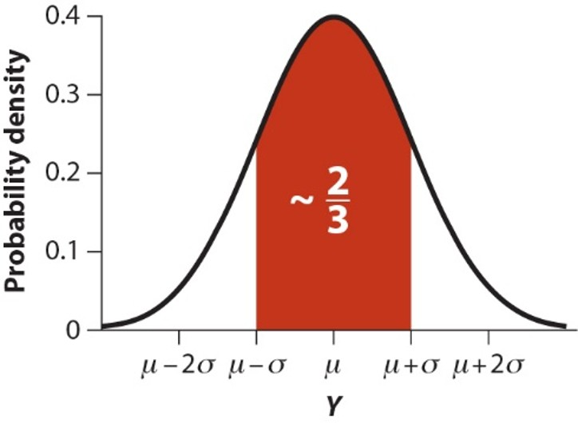{fig-align="center"}
:::

::: {.column width="30%"}
[About 95% of AUC is \< 2 sd from mean]{.keyword}

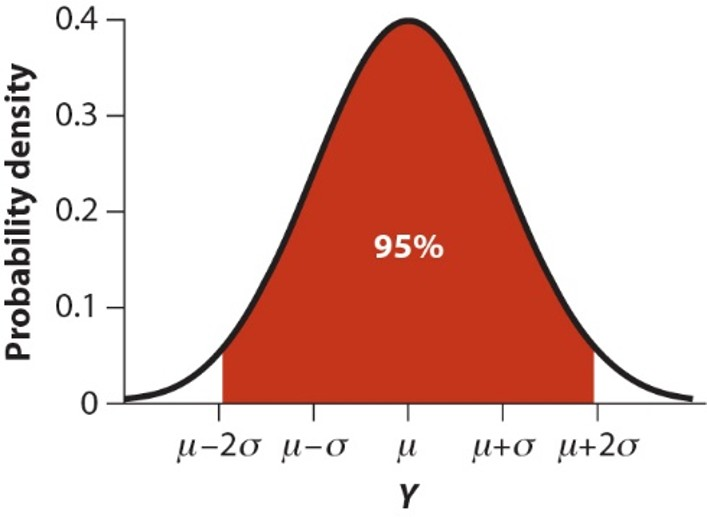{fig-align="center"}
:::
::::::

## The standard normal distribution

::::: columns
::: {.column width="50%"}
-   The [standard normal distribution]{.keyword} is a normal
    distribution with:

    -   mean = zero

    -   standard deviation = one

-   Uses the symbol $Z$ to indicate a variable having a standard normal
    distribution
:::

::: {.column width="50%"}
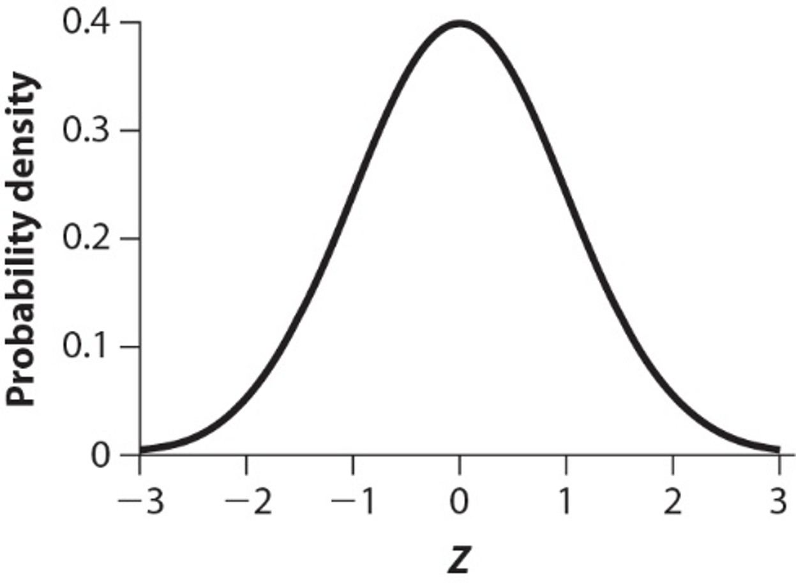
:::
:::::

## Statistical Table B: The standard normal ( $Z$ ) distribution

::::: columns
::: {.column width="50%"}
-   Gives probabilities under the right tail of the standard normal
    distribution.

-   An example of a probability under the standard normal curve: the
    probability of sampling a value greater than or equal to the value
    $1.96$ is $0.025$, or $2.5\%$.
:::

::: {.column width="50%"}
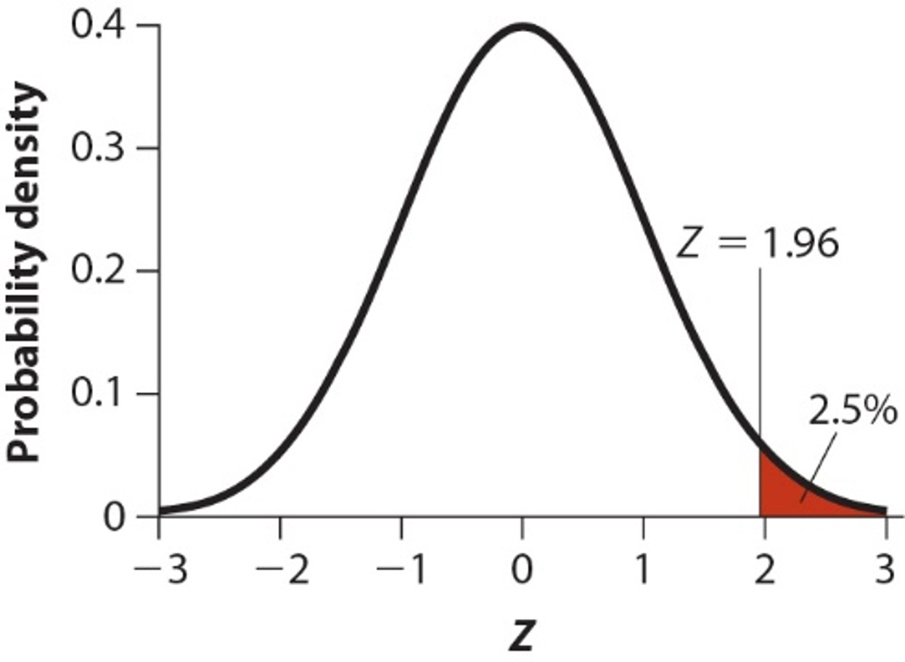{fig-align="center"}
:::
:::::

## Using Statistical table B

::::: columns
::: {.column width="50%"}
-   To find the area under the standard normal distribution to the right
    of $Z=1.96$ :

    1.  Find the first two digits $1.9$ on the left

    2.  Find the third digit $6$ on the top

    3.  The intersection gives the area under the curve

-   R equivalent:

    `1 - pnorm(q = 1.96)`
:::

::: {.column width="50%"}
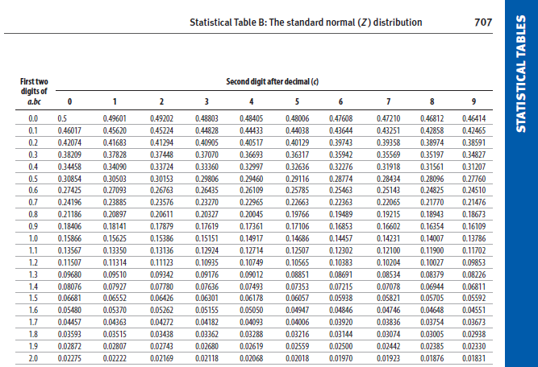
:::
:::::

## To find a AUC for a range, use subtraction

Example: What proportion of the population have values between X and Y?

To solve: Subtract 𝑍-score for Y from 𝑍-score for X

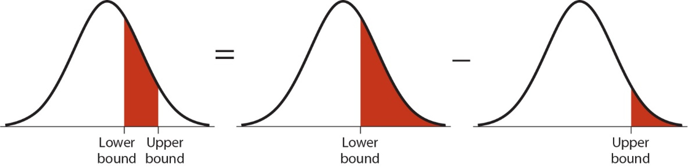{fig-align="center"}

# Z-Scores (standard normal deviates)

## Using the standard normal to describe any normal distribution

::::: columns
::: {.column width="50%"}
-   There are an infinite number of normal distributions but they are
    all similar in shape
-   This allows us to use a simple **transformation** to obtain
    probabilities under any normal distribution
-   A standard normal deviate, or [𝒁-score]{.keyword}, tells us how many
    standard deviations a particular value is from the mean
:::

::: {.column width="50%"}
$$
Z = \frac{Y-\mu}{\sigma}
$$

Where:

-   $Z$ is a standard normal value

-   $Y$ is any particular value

-   $\mu$ is the population mean

-   $\sigma$ is the population standard deviation
:::
:::::

## Practical application of 𝑍 scores

-   In many (most?) kinds of modeling, **raw values of predictor
    variables should be converted to 𝑍 scores**.

-   Two reasons:

    1.  Effects size of variables can be compared directly (e.g. when
        doing multiple regression)

    2.  Facilitates model convergence (computers have an easier time
        optimizing likelihoods to estimate model parameters). In terms
        that matter to you: the computer goes faster and is less likely
        to throw an error.

## The normal distribution of sample means

::::: columns
::: {.column width="50%"}
-   $\bar{Y}$ is the mean of a single sample.

-   If a variable $Y$ has a normal distribution in a population, then
    the **distribution of sample means is also normal**

-   The standard deviation of the sampling distribution for $\bar{Y}$ is
    known as the standard error of the mean

$$
\sigma_{\bar{Y}}=\frac{\sigma}{\sqrt{n}}
$$
:::

::: {.column width="50%"}
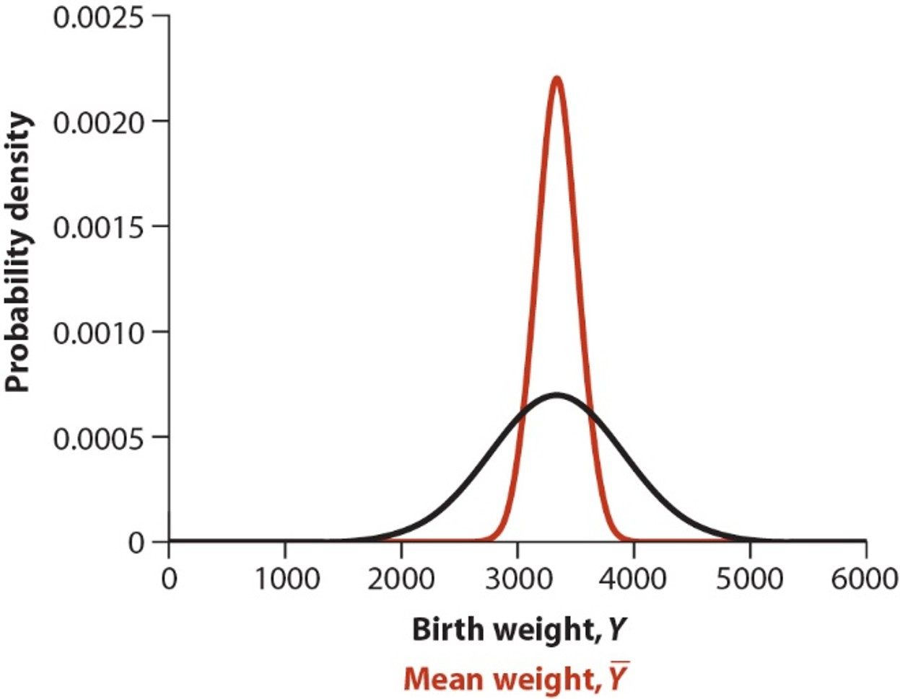
:::
:::::

## As sample size $n$ increases, $\sigma_{\bar{Y}}$ decreases

::::: columns
::: {.column width="50%"}
Example: The distribution of sample means based on sample sizes of

-   𝑛=10 (red)

-   𝑛=100 (blue)

-   𝑛=1000 (black)

Note the change in scale from previous figures.
:::

::: {.column width="50%"}
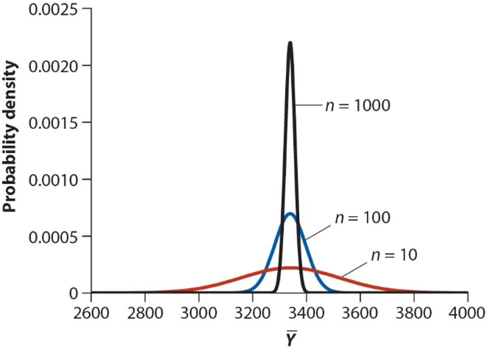
:::
:::::

## Calculating probabilities of sample means

-   You can calculate the probability of obtaining a sample with a mean
    in a given range:

    -   To do this, calculate the 𝑍 score for a given sample mean
        $\bar{Y}$

    -   Then calculate the 𝑍 score for another sample mean $\bar{Y}$

    -   Subtract one 𝑍 score from the other to get the AUC between the
        two 𝑍 scores

# Practice Problem #1

## Question

::::: columns
::: {.column width="50%"}
The natural log of growth (change in radius per year in mm) of Engelmann
spruce is approximately normally distributed with **mean of 0.037 log
units** and **standard deviation 0.385**.

Following these steps, determine the probability that a tree has a **bad
year**, defined as having growth less than **−0.050 log units** in a
year.
:::

::: {.column width="50%"}

:::
:::::

## STEP 1: Sketch a normal distribution with $\mu=0.037$, $\operatorname{sd}=0.385$

:::::::::::::: columns
:::::::::: {.column width="25%"}
::: {.fragment fragment-index="1"}
1.  Draw axes
:::

::: {.fragment fragment-index="3"}
2.  Mean goes in middle
:::

::: {.fragment fragment-index="5"}
3.  Calculate width:
:::

::: {.normal-eq-column .fragment fragment-index="7"}
$$
\mu \pm 3\sigma
\\0.037 \pm 3 \times 0.385
\\0.037 \pm 1.155
\\-1.118 < \mu < 1.192
$$
:::

::: {.fragment fragment-index="8"}
4.  Label x-axis ticks
:::

::: {.fragment fragment-index="10"}
5.  Label x-axis
:::

::: {.fragment fragment-index="12"}
6.  Draw bell-shape and label y-axis
:::
::::::::::

::: {.column width="25%"}
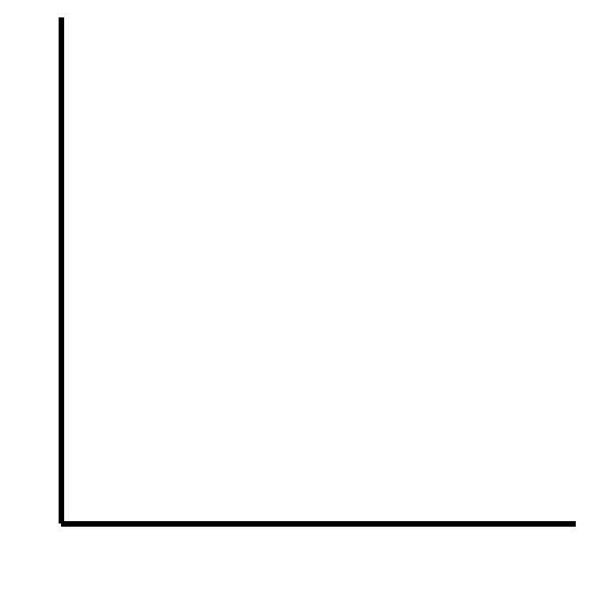{.fragment fig-align="center"
fragment-index="2"} 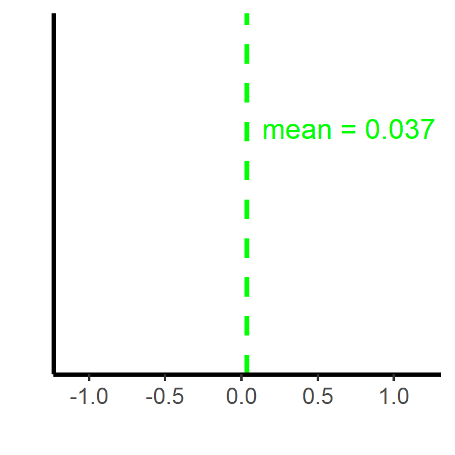{.fragment
fig-align="center" fragment-index="9"}
:::

::: {.column width="25%"}
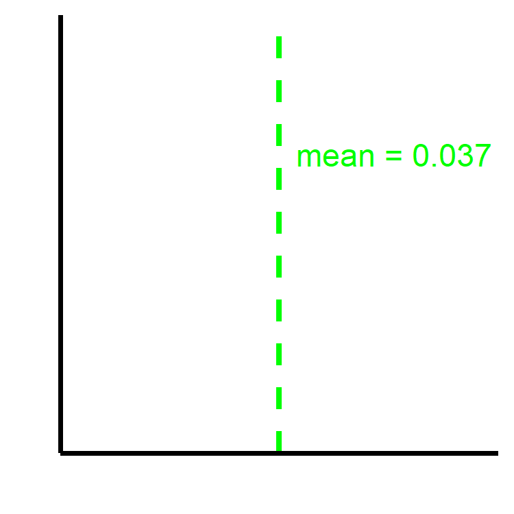{.fragment fig-align="center"
fragment-index="4"} 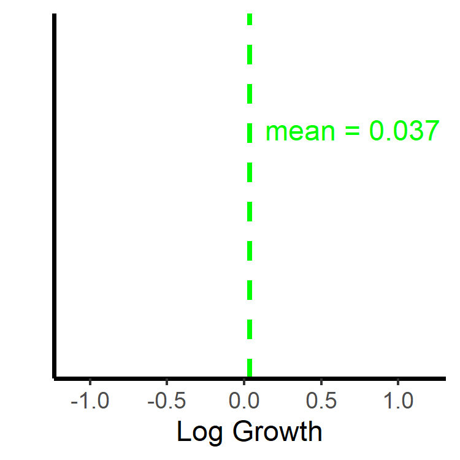{.fragment
fig-align="center" fragment-index="11"}
:::

::: {.column width="25%"}
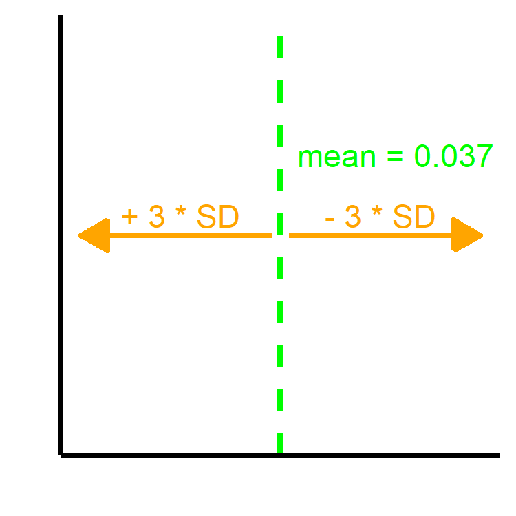{.fragment fig-align="center"
fragment-index="6"} 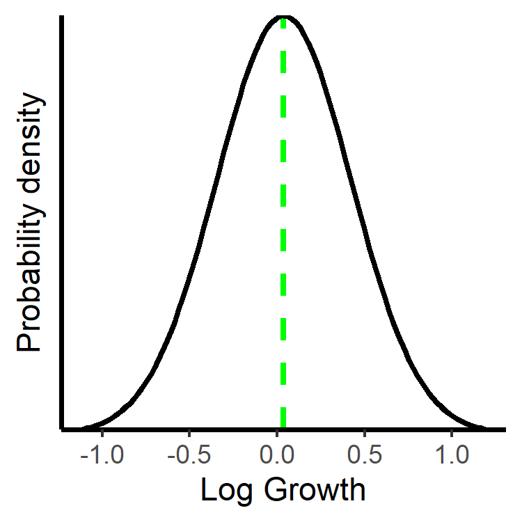{.fragment
fig-align="center" fragment-index="13"}
:::
::::::::::::::

## STEP 2: Mark the values that we are trying to determine

(i.e., those values less than −0.05)

:::::: columns
::: {.column .fragment width="33%" fragment-index="1"}
... From previous step

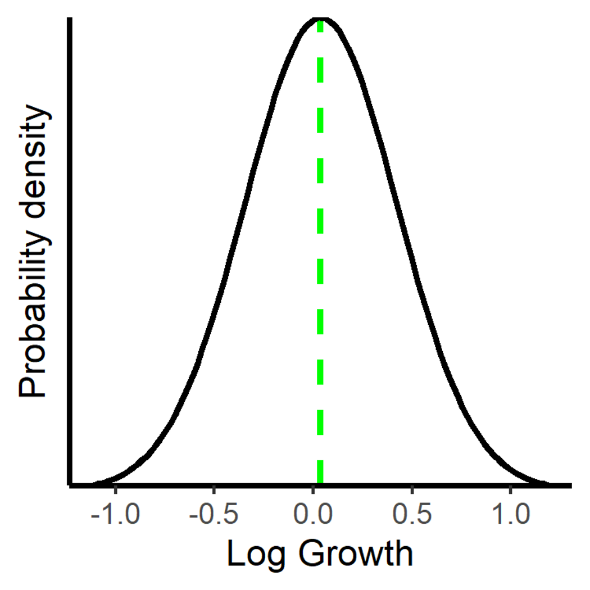
:::

::: {.column .fragment width="33%" fragment-index="2"}
1.  Mark the value (-0.05)

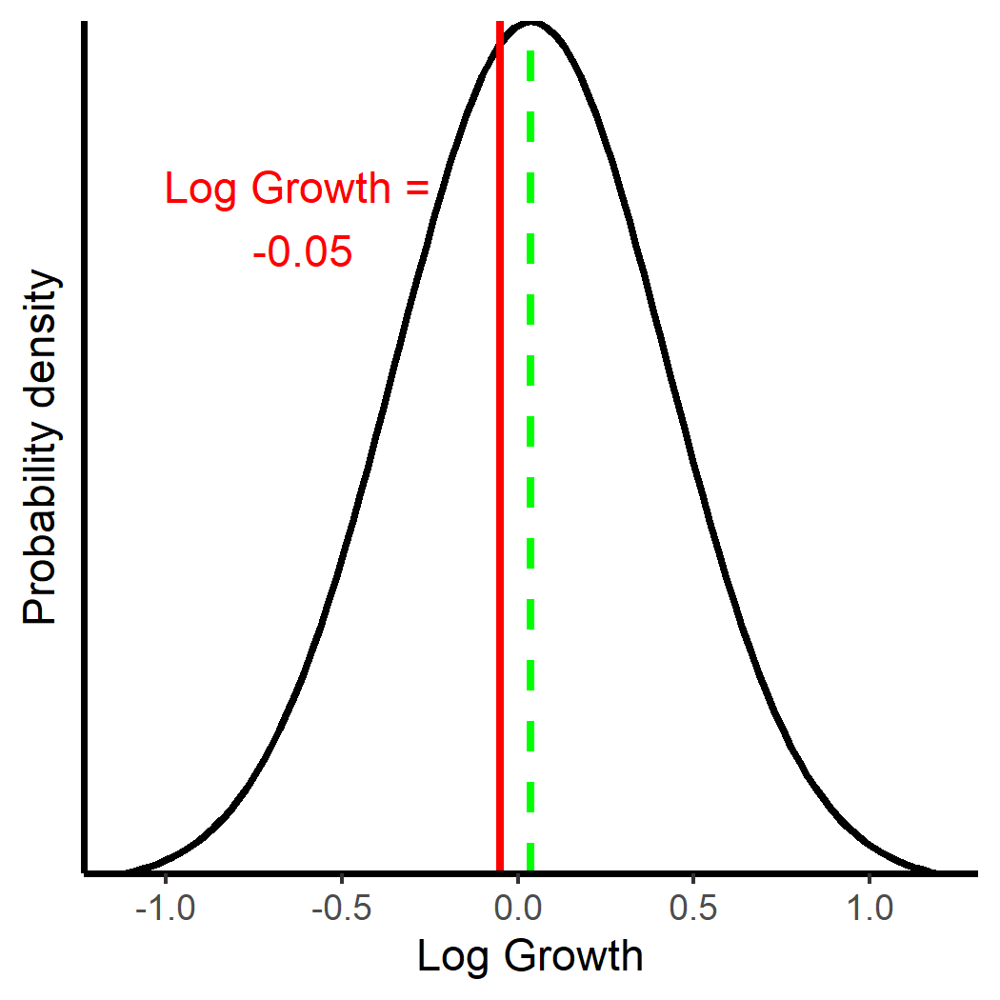
:::

::: {.column .fragment width="33%" fragment-index="3"}
2.  Fill in the area (\< -0.05)

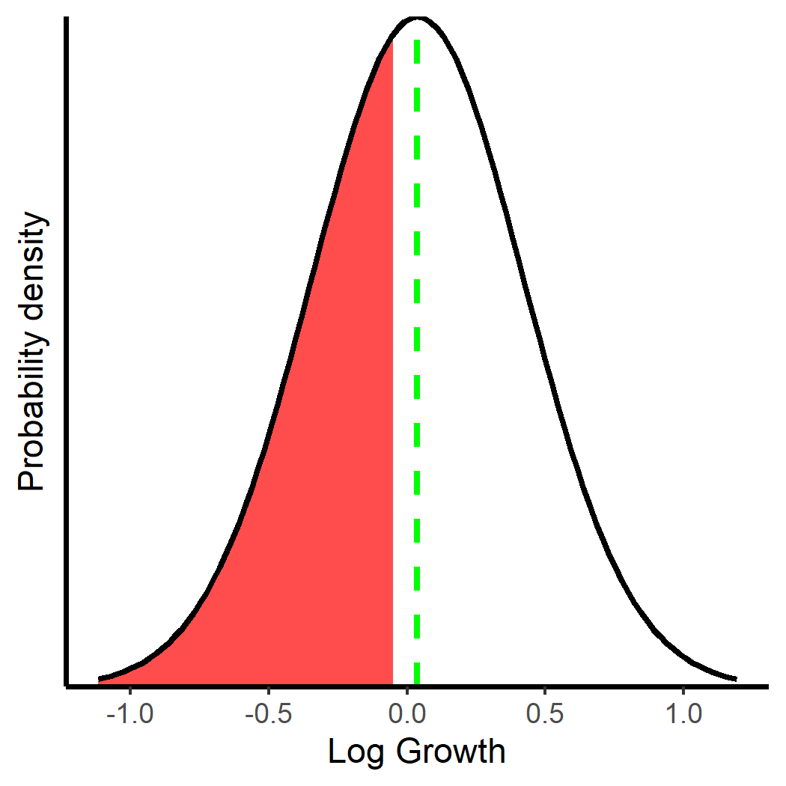
:::
::::::

## STEP 3: Calculate the standard normal deviate (𝑍)

Calculate the standard normal deviate (𝑍) associated with the value we
are interested in here, −0.05

:::::::: columns
::: {.column width="50%"}
-   Mean $\mu=0.037$ log units

-   Standard deviation $\sigma=0.385$ log units

-   Value of interest $Y=-0.05$ log units
:::

:::::: {.column width="50%"}
::: {.fragment fragment-index="1"}
$$
Z = \frac{Y-\mu}{\sigma}
$$
:::

::: {.fragment fragment-index="2"}
$$
\frac{-0.05-0.037}{0.385}
$$
:::

::: {.fragment fragment-index="3"}
$$
-0.226
$$
:::
::::::
::::::::

## STEP 4: Find probability of value \< the Z-score

We are interested in the probability of getting a value less than
-0.226.

:::::: columns
::: {.column .fragment width="33%" fragment-index="1"}
Goal: Find the area to the left of the red line

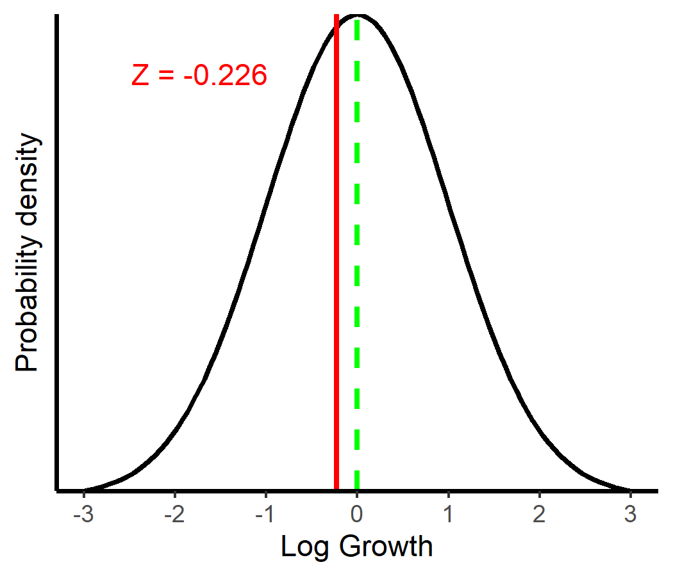{width="440"}
:::

::: {.column .fragment width="33%" fragment-index="2"}
Problem: the Z table only shows areas to right of a given value

{width="570"}
:::

::: {.column .fragment width="33%" fragment-index="3"}
Solution: Find an equivalent area to right of a given value

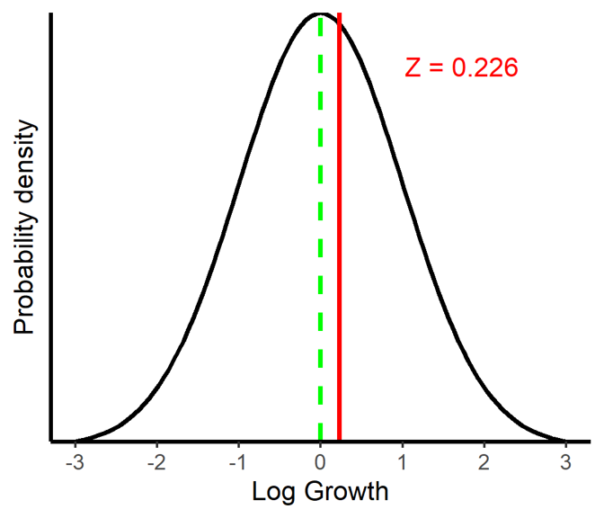{.fragment width="440" fragment-index="4"}
:::
::::::

## STEP 5: Find the P-value in the statistical table

What is the probability that a random draw from a standard normal
distribution will be greater than 0.226?

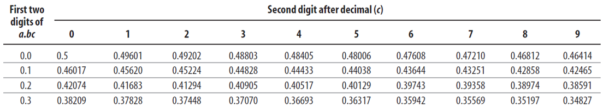{fig-align="center"}

:::::: columns
::: {.column width="50%"}

:::

:::: {.column width="50%"}
::: incremental
-   Find area to right of $Z=0.226$

-   Use statistical table B

-   Area to right of $Z=0.226$ is about $0.40905$

-   Probability of randomly drawing a value greater than $Z=0.226$ is
    $P=0.40905$

-   or about $41\%$
:::
::::
::::::

## STEP 6: Calculate original area of interest

What is the probability that a random draw from a standard normal
distribution will be less than −0.226?

:::::: columns
::: {.column width="50%"}

:::

:::: {.column width="50%"}
::: incremental
-   Remember, the area we were interested in was not the area to the
    right of +0.226 but the area to the left of -0.226

-   What is that area?

-   Same as area to the right of +0.226:

    $0.40905$
:::
::::
::::::

## STEP 7: Answer the question

What is the probability that a tree has a bad growth year, that is, less
than −0.05 log units?

::::::: columns
::: {.column width="27%"}
{fig-align="center"}
:::

::: {.column width="40%"}
{fig-align="center"}
:::

:::: {.column width="33%"}
::: incremental
-   Probability of $Y \le -0.05 \text{ log units}$ ?

-   Same as probability of $Z \le -0.226$

-   $P=0.40904$
:::
::::
:::::::
