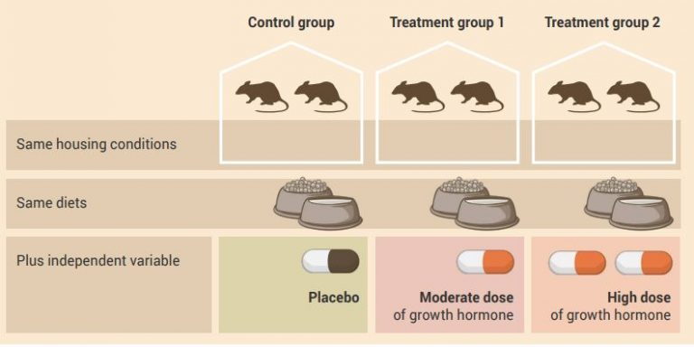
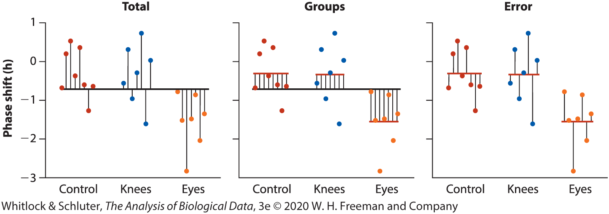

## Learning Objectives

-   Explain why multiple pairwise tests inflate Type I error and why ANOVA is needed
-   Describe how total variation is partitioned into between-group and within-group components
-   Interpret sum of squares and mean squares as measures of variation
-   Explain the $F$-statistic as a ratio of between-group to within-group variation
-   State and interpret the hypotheses tested in a one-way ANOVA
-   Interpret ANOVA output, including the meaning of a significant $F$-test
-   Identify assumptions of ANOVA and assess when they may be violated
-   Describe alternatives to ANOVA, including data transformation and the Kruskal–Wallis test

## Many biological questions involve more than two groups

::::: columns
::: {.column width="50%"}
-   Experiments often include **multiple treatments**, not just two
-   Example: two medications and a placebo control
-   This allows us to ask richer questions:
    -   Are both treatments better than the control?
    -   Is one treatment better than the other?
    -   How large are these differences?
:::

::: {.column width="50%"}
{#fig-mice-groups}
:::
:::::

## Comparing groups two at a time inflates false positives

::::: columns
::: {.column width="50%"}
-   One approach is to run multiple **two-sample tests**:
    -   Group 1 vs 2
    -   Group 2 vs 3
    -   Group 1 vs 3
-   This seems reasonable, but it does not scale with more groups
:::

::: {.column width="50%"}
```{r}
#| label: fig-pairwise-comparisons
#| fig-cap: Pairwise comparisons among three treatment groups. Each bracket represents one of the three two-group comparisons that would be made if the groups were analyzed two at a time.
#| fig-alt: Three treatment groups labeled A. Placebo, B. Moderate dose, and C. High dose, each shown with a differently colored bug icon. Above them are three comparison brackets labeled A-B, B-C, and A-C.

library(ggplot2)
library(ggsvg)

# Data for the three groups
groups <- data.frame(
  x = c(1, 2, 3),
  y = c(0, 0, 0),
  label = c("Treatment A", "Treatment B", "Treatment C"),
  color = c("#D55E00", "#0072B2", "#009E73"),
  image = "images/bug-fill.svg"
)

# Helper function to draw a bracket
bracket_df <- function(x1, x2, y, h = 0.15, label) {
  data.frame(
    x = c(x1, x1, x2, x2),
    xend = c(x1, x2, x2, x2),
    y = c(y - h, y, y, y - h),
    yend = c(y, y, y - h, y - h),
    label_x = (x1 + x2) / 2,
    label_y = y + 0.12,
    label = label
  )
}

# Brackets for the three pairwise comparisons
b1 <- bracket_df(1, 2, y = .7, label = "A-B")
b2 <- bracket_df(2, 3, y = 1.00, label = "B-C")
b3 <- bracket_df(1, 3, y = 1.3, label = "A-C")

brackets <- rbind(b1[, 1:4], b2[, 1:4], b3[, 1:4])
bracket_labels <- rbind(
  b1[1, c("label_x", "label_y", "label")],
  b2[1, c("label_x", "label_y", "label")],
  b3[1, c("label_x", "label_y", "label")]
)

# svg
svg_path <- "images/bug-fill.svg"
svg_txt <- paste(readLines(svg_path), collapse = "\n")

ggplot() +
  geom_point_svg(
    data = groups,
    aes(x = x, y = y, svg = svg_txt, fill = color, css("path", fill = color), svg_width = 100),
    size = 35
  ) +
  scale_svg_fill_identity(
    aesthetics = css("path", fill = color)
  ) +
  geom_segment(
    data = brackets,
    aes(x = x, xend = xend, y = y, yend = yend),
    linewidth = 0.7
  ) +
  geom_text(
    data = bracket_labels,
    aes(x = label_x, y = label_y, label = label),
    size = 6
  ) +
  geom_text(
    data = groups,
    aes(x = x, y = -0.6, label = label),
    size = 6
  ) +
  coord_cartesian(
    xlim = c(0.5, 3.5),
    ylim = c(-0.6, 1.65),
    clip = "off"
  ) +
  guides(fill = "none") +
  theme_void() #+
  # theme(
  #   plot.margin = margin(20, 20, 40, 20)
  # )
```
:::
:::::

## Multiple tests inflate Type I error

::::: columns
::: {.column width="50%"}
-   Problem:
    -   Each test has a chance of a **Type I error (false positive)**
    -   Multiple tests increase the chance of *at least one* false positive
-   Example:
    -   5 groups → 10 pairwise tests
    -   Up to \~40% chance of at least one false positive if all nulls are true
:::

::: {.column width="50%"}
```{r}
#| label: fig-type1-inflation
#| fig-cap: Probability of at least one Type I error as the number of pairwise comparisons increases ($\alpha$ = 0.05). Assuming independent tests, the probability rises rapidly with more comparisons.
#| fig-alt: Line plot showing probability of at least one Type I error on the y-axis and number of pairwise comparisons on the x-axis. The curve increases from near 0 to close to 1 as the number of comparisons increases. A dashed horizontal line marks alpha = 0.05.

library(ggplot2)
library(ggrepel)

alpha <- 0.05
k <- 1:20

df <- data.frame(
  comparisons = k,
  prob = 1 - (1 - alpha)^k
)

label_df <- subset(df, comparisons %in% c(3, 6, 10, 15))
label_df$label <- c(
  "3 comps\n(3 groups)",
  "6 comps\n(4 groups)",
  "10 comps\n(5 groups)",
  "15 comps\n(6 groups)"
)

ggplot(df, aes(x = comparisons, y = prob)) +
  geom_line(linewidth = 1.2) +
  geom_point(size = 2.5) +
  geom_hline(yintercept = alpha, linetype = "dashed") +
  geom_point(data = label_df, size = 4, color = "#D55E00") +
  geom_text_repel(
    data = label_df,
    aes(label = label),
    box.padding = 0.4,
    point.padding = 0.4,
    min.segment.length = 0,
    seed = 123,
    nudge_y = .3,
    size = 8
  ) +
  scale_y_continuous(
    limits = c(0, 1),
    expand = c(0, 0)
  ) +
  scale_x_continuous(breaks = seq(0, 20, 2)) +
  labs(
    x = "Number of pairwise comparisons",
    y = "Probability of at least one Type I error"
  ) +
  theme_classic(base_size = 20)
```
:::
:::::

## We need a single test for all groups

-   Goal:
    -   Test for differences **across all groups at once**
-   Avoid:
    -   Repeated testing
    -   Inflated Type I error

# Analysis of Variance (ANOVA)

## ANOVA compares all group means simultaneously

-   [Analysis of variance (ANOVA)]{.keyword} tests for differences among **multiple means**
-   Uses a **single overall test**
-   Based on:
    -   Comparing variation **among groups** to variation **within groups**
-   Tests:
    -   Are individuals from different groups, on average, more different than individuals from the same group?

## ANOVA tests variation to detect differences in means

-   The name (analysis of variance) can be misleading:
    -   We are interested in **means**, not variances
-   Key idea:
    -   If group means differ → there will be **variation among groups**
-   Therefore:
    -   Testing for variation among groups tells us whether means differ

## One-way ANOVA analyzes one explanatory variable

-   [One-way ANOVA]{.keyword}:
    -   One explanatory variable (factor)
    -   Multiple groups defined by that factor
-   Examples:
    -   Treatment type
    -   Habitat type
    -   Species

## Case Study: Does light exposure affect circadian phase shift?

::::: columns
::: {.column width="50%"}
-   Study of how **light exposure shifts the body’s internal clock** (circadian rhythm)

-   22 participants randomly assigned to one of three treatments:

    -   No light (control)
    -   Light to knees
    -   Light to eyes

-   Each person received a single 3-hour light exposure

-   Researchers measured how much each person’s internal clock shifted
:::

::: {.column width="50%"}
{#fig-light-treatment-example fig-alt="Dot plot showing individual phase shift values for three groups: control, knees, and eyes. Each group has several open circles representing participants. Filled dots indicate group means with vertical error bars. The eyes group shows more negative values (greater delays), while control and knees groups are closer to zero." fig-align="center" width="728"}
:::
:::::

## ANOVA asks: where does the variation come from?

-   Data vary across individuals, even within the same group
-   Some variation is due to:
    -   real differences among groups
    -   random variation within groups
-   Goal: Compare **between-group variation** to **within-group variation**

## Total variation can be partitioned

-   [Total variation]{.keyword}: how much all observations vary around the overall mean

-   This can be split into two parts:

    -   [Between-group variation]{.keyword}: differences among group means
    -   [Within-group variation]{.keyword}: variation among individuals within groups

-   ANOVA works by comparing these two sources of variation

## Partitioning variation in a real dataset

::::: columns
::: {.column width="50%"}
-   Same data shown three ways
    -   [Total]{.keyword}: differences between each observation and the overall mean
    -   [Groups]{.keyword}: differences between each group mean and the overall mean
    -   [Error]{.keyword}: differences between observations and their group mean
-   Total variation = Groups + Error
-   ANOVA asks whether:
    -   variation among group means is large relative to variation within groups
:::

::: {.column width="50%"}
{fig-alt="Three-panel plot labeled Total, Groups, and Error showing the same data for control, knees, and eyes treatments. Points represent individual observations. The Groups panel shows differences among group means, while the Error panel shows variation within each group around its mean."}
:::
:::::

## Mean squares summarize variation

::::: columns
::: {.column width="50%"}
-   ANOVA uses [mean squares]{.keyword} (MS) to measure variation
-   Two key quantities:
    -   $MS_{groups}$: variation among group means
    -   $MS_{error}$: variation within groups
-   Each is:
    -   a measure of variability
    -   converted to an average amount of variation per sample unit
-   Larger values = more variation
:::

::: {.column width="50%"}
-   Start with [sum of squares]{.keyword} (SS):
    -   sum of squared deviations from a mean
-   Convert to mean squares: $MS = \frac{SS}{df}$
-   So:
    -   $MS_{groups} = \frac{SS_{groups}}{df_{groups}}$
    -   $MS_{error} = \frac{SS_{error}}{df_{error}}$
-   Dividing by $df$ puts both on the same scale so they can be compared
:::
:::::

## The $F$-statistic compares two sources of variation

-   ANOVA test statistic:

$$
F = \frac{MS_{groups}}{MS_{error}}
$$

-   Interpretation:
    -   $F \approx 1$ : groups are similar
    -   $F > 1$ : group means differ more than expected by chance
-   The larger the ratio:
    -   the stronger the evidence for differences among groups

## ANOVA hypotheses

-   Null hypothesis:

$$
H_0: \mu_1 = \mu_2 = \cdots = \mu_k
$$

-   Alternative hypothesis:
    -   Not all group means are equal
-   Important:
    -   ANOVA tests for **any difference**, not which groups differ

## Interpreting the ANOVA result

-   If $F$ is large → small p-value:
    -   Reject $H_0$
    -   Evidence that at least one group mean differs
-   If $F$ is near 1:
    -   Fail to reject $H_0$
    -   Differences are consistent with random variation
-   Next step (if significant):
    -   Determine **which groups differ**
