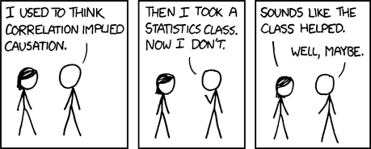
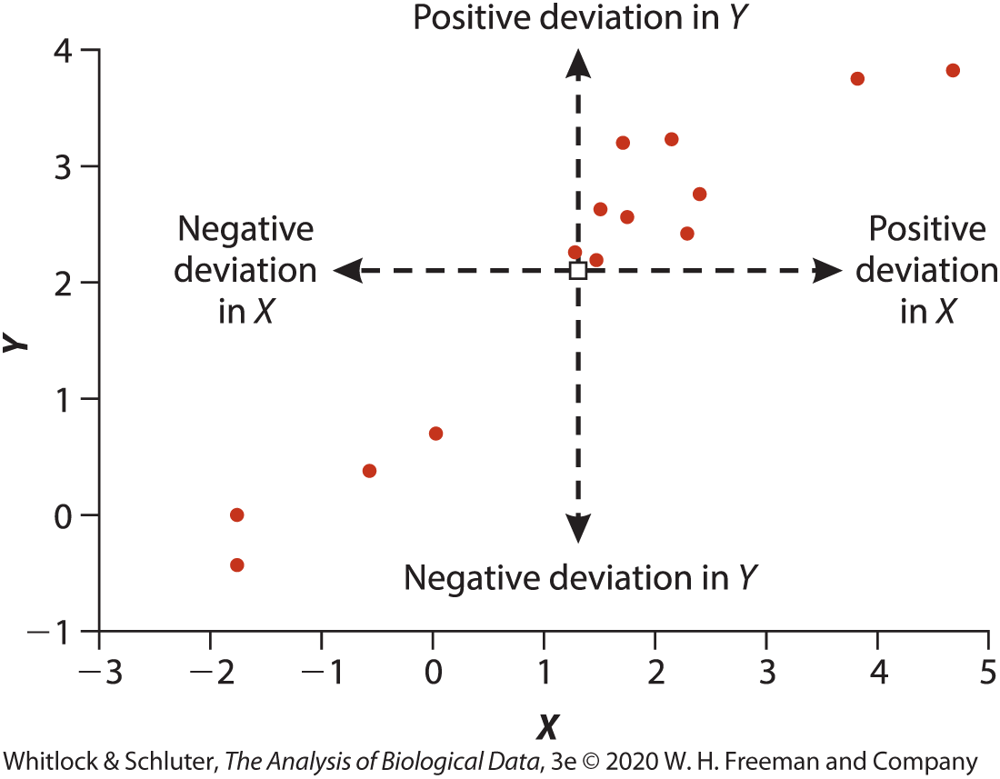
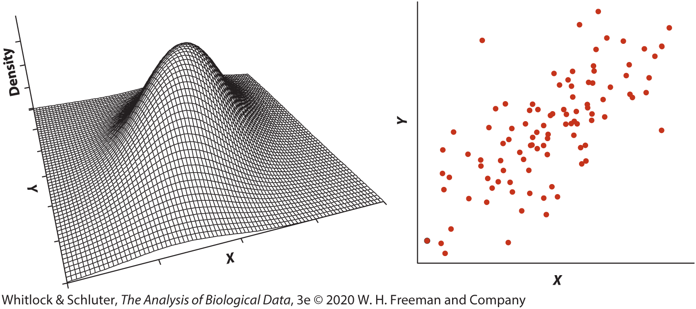
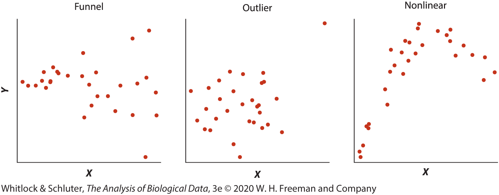
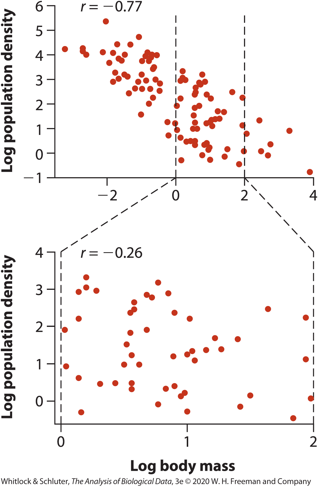

## Learning objectives

-   Define correlation as the association between two numerical variables
-   Interpret the sign and magnitude of Pearson’s correlation coefficient $r$
-   Explain why correlation does not imply causation
-   Interpret confidence intervals and hypothesis tests for correlation
-   Use scatterplots to assess assumptions and detect common violations
-   Explain how restricted range and measurement error can weaken observed correlations
-   Identify when Spearman rank correlation or a correlation matrix is appropriate

## [Correlation]{.keyword} between two numerical variables

::::: columns
::: {.column width="50%"}
-   Correlation describes the **strength** and **direction** of association between two numerical variables
    -   Positive correlation: $X \uparrow,\ Y \uparrow$
    -   Negative correlation: $X \uparrow,\ Y \downarrow$
-   Measured with a **correlation coefficient**, often denoted $r$
-   Based on the pattern of **scatter** in a scatter plot
-   Correlation describes association, not how steeply one variable changes
:::

::: {.column width="50%"}
:::
:::::

## Example: body mass and brain mass in mammals

::::: columns
::: {.column width="50%"}
-   Each point represents one mammal species
-   Species with larger body mass tend to have larger brain mass
-   This is a **positive correlation**: $X \uparrow,\ Y \uparrow$
-   The relationship is strong, but not perfect
-   Some species have larger or smaller brains than expected for their body size
:::

::: {.column width="50%"}
```{r}
#| label: fig-mammal-brain-body
#| fig-cap: "Brain mass versus body mass for selected mammals. Each point is a species from the R MASS package Animals dataset (Venables & Ripley 2002). Data shown on logarithmic axes."
#| fig-alt: "Scatterplot of mammal body mass on the x-axis and brain mass on the y-axis, both on logarithmic scales. Points represent species and are labeled with names such as human, chimpanzee, elephant, whale, rat, and mole. Larger mammals generally have larger brains."

library(tidyverse)
library(MASS)
library(ggrepel)
library(tibble)

animal_points <-
  Animals |>
  rownames_to_column("species") |>
  filter(!species %in% c("Dipliodocus", "Triceratops", "Brachiosaurus")) |>
  filter(species %in% c(
      "African elephant", "Asian elephant", "Giraffe", "Cow", 
      "Gorilla", "Human", "Chimpanzee", "Pig", "Jaguar",
      "Rhesus monkey", "Goat", "Kangaroo",
      "Cat", "Rabbit", "Mountain beaver", "Guinea pig",
      "Rat", "Mole", "Golden hamster", "Mouse"
    ))

animal_scatter <-
  animal_points |> 
  ggplot(aes(x = body, y = brain, label = species)) +
  geom_point(color = "firebrick", size = 2.8) +
  scale_x_log10() +
  scale_y_log10() +
  labs(
    x = "Body mass (kg)",
    y = "Brain mass (g)"
  ) +
  theme_classic(base_size = 18)

animal_scatter +
    geom_text_repel(
    size = 4,
    box.padding = 0.5,
    force = 2,
    point.padding = 0.4,
    segment.color = "gray40",
    min.segment.length = 0,
    max.overlaps = Inf,
    max.time = 2,
    max.iter = 20000
  )
```
:::
:::::

## Correlation does not imply causation

::::: columns
::: {.column width="50%"}
-   A correlation means two variables are associated, not that one causes the other
-   X may affect Y, Y may affect X, or both may be influenced by a third variable
-   Coincidental correlations can also occur by chance
-   Correlation alone cannot establish cause-and-effect relationships
:::

::: {.column width="50%"}
{fig-align="center" width="800"}
:::
:::::

## Direction of correlation

::::: columns
::: {.column width="50%"}
-   **Positive correlation**: as one variable increases, the other tends to increase
-   **Negative correlation**: as one variable increases, the other tends to decrease
-   The sign of the correlation describes the **direction** of association
-   Direction does not tell us how strong the relationship is
:::

::: {.column width="50%"}
```{r}
#| label: fig-correlation-direction
#| fig-cap: "Examples of positive and negative correlation."
#| fig-alt: "Two-panel scatterplot. Left panel shows an upward trend representing positive correlation. Right panel shows a downward trend representing negative correlation."
#| fig-asp: 0.62

library(tidyverse)
library(see)

set.seed(275)

pos_type <- "Positive correlation\n( + )"
neg_type <- "Negative correlation\n( - )"
type_levels <- c(pos_type, neg_type)

pos_dat <- tibble(
  x = seq(1, 10, length.out = 20),
  y = x + rnorm(20, sd = 1.3),
  type = fct(pos_type, levels = type_levels)
)

neg_dat <- tibble(
  x = seq(1, 10, length.out = 20),
  y = 11 - x + rnorm(20, sd = 1.3),
  type = fct(neg_type, levels = type_levels)
)

arrow_dat <- tibble(
  type = fct(c(pos_type, neg_type), levels = type_levels),
  x = c(1+1, 1+4+1),
  y = c(1+4+1, 10-1),
  xend = c(10-4-1, 10-1),
  yend = c(10-1, 1+4+1)
)

label_dat <- tibble(
  type = fct(c(pos_type, neg_type), levels = type_levels),
  x = c(3, 8),
  y = c(10.5, 10.5),
  label = c(
    "Y increases\nas X increases",
    "Y decreases\nas X increases"
  )
)

bind_rows(pos_dat, neg_dat) |>
  ggplot(aes(x = x, y = y, color = type)) +
  geom_smooth(method = "lm", se = FALSE, 
              linewidth = .8, linetype = "dashed",
              color = "gray35") +
  geom_point(size = 3.2) +
  scale_color_oi(guide = "none") +
  scale_x_continuous(expand = expansion(mult = 0.1)) +
  scale_y_continuous(expand = expansion(mult = 0.1)) +
  facet_wrap(~type, nrow = 1) +
  labs(x = "X", y = "Y") +
  theme_classic(base_size = 22) +
  theme(
    axis.text = element_blank(),
    axis.ticks = element_blank(),
    strip.background = element_blank(),
    strip.text = element_text(face = "bold", size = 22),
    panel.spacing = unit(1.7, "lines"),
    axis.title.x = element_text(margin = margin(t = 18)),
    axis.title.y = element_text(margin = margin(r = 18))
  ) +
  geom_segment(
    data = arrow_dat,
    aes(x = x, y = y, xend = xend, yend = yend),
    inherit.aes = FALSE,
    arrow = arrow(length = unit(0.22, "cm")),
    linewidth = 0.8,
    color = "gray20"
  ) +
  geom_text(
    data = label_dat,
    aes(x = x, y = y, label = label, hjust = label),
    inherit.aes = FALSE,
    size = 4,
    color = "gray20",
    fontface = "bold"
  )
```
:::
:::::

## Strength of correlation

-   **Strength** describes how closely the points follow a linear trend
    -   Stronger correlation: points cluster tightly around a line
    -   Weaker correlation: points show more scatter around the line

```{r}
#| label: fig-correlation-r-values
#| fig-cap: "Examples of negative, zero, and positive correlations ranging from weak to strong linear relationships. Stronger relationships show points clustered more closely around a straight-line trend."
#| fig-alt: "Seven-panel figure of scatterplots arranged from strong negative to strong positive relationships. The left panels show negative correlations, with points sloping downward from weak to perfect negative. The middle panel shows no linear relationship. The right panels show positive correlations, with points sloping upward from weak to perfect positive. Stronger relationships have less scatter around a line."
#| fig-asp: 0.22
#| fig-width: 18

library(tidyverse)
library(patchwork)

make_panel <- function(r, n = 24, seed = 275) {
  set.seed(seed + round((r + 1) * 1000))
  
  # Start with a centered, scaled x variable
  x <- sort(rnorm(n))
  x <- as.numeric(scale(x, center = TRUE, scale = TRUE))
  
  # Create a second variable orthogonal to x
  z <- rnorm(n)
  z <- z - mean(z)
  z <- z - sum(z * x) / sum(x * x) * x
  z <- as.numeric(scale(z, center = TRUE, scale = TRUE))
  
  # Construct y so the sample correlation with x is exactly r
  y <- r * x + sqrt(1 - r^2) * z
  
  tibble(x = x, y = y, r = r)
}

r_vals <- c(-1, -0.7, -0.4, 0, 0.3, 0.8, 1)

plot_dat <- 
  map_dfr(r_vals, make_panel) |>
  mutate(
    panel = paste0("r = ", as.character(r)),
    panel = as_factor(panel),
    row = 1
  )

note_panels <- tibble(
  panel = factor(
    levels(plot_dat$panel),
    levels = levels(plot_dat$panel)
  ),
  x = 0,
  y = 0
)

note_dat <- tibble(
  panel = fct(levels(plot_dat$panel)),
  x = 0,
  y = 0,
  label = c(
    "Points fall exactly\non a straight line",
    "Strong -",
    "Weak -",
    "No linear\nrelationship",
    "Weak +",
    "Strong +",
    "Points fall exactly\non a straight line"
  )
)

plot_top <- 
  ggplot(plot_dat, aes(x = x, y = y)) +
  geom_point(size = 1.6) +
  facet_wrap(~ panel, nrow = 1, strip.position = "bottom") +
  coord_fixed(ratio = 1) +
  labs(x = NULL, y = NULL) +
  theme_gray(base_size = 28) +
  theme(
    strip.placement = "outside",
    #strip.background = element_rect(fill="lightgreen"),
    strip.background = element_blank(),
    strip.text = element_text(face = "bold"),
    axis.text = element_blank(),
    axis.ticks = element_blank(),
    plot.margin = margin(0, 15, 0, 15),
    strip.text.x.bottom = element_text(margin = margin(t = 0, b = 0)),
    plot.background = element_rect(fill="lightblue"),
    strip.switch.pad.wrap = unit(0, "pt"),
  )

plot_bottom <- ggplot(note_panels, aes(x = x, y = y)) +
  geom_blank() +
  geom_text(
    data = note_dat,
    aes(label = label),
    size = 7,
    lineheight = 1.05
  ) +
  facet_wrap(~ panel, nrow = 1) +
  coord_cartesian(
    xlim = c(-1, 1),
    ylim = c(-.5, .5),
    clip = "off"
  ) +
  labs(x = NULL, y = NULL) +
  theme_void(base_size = 28) +
  theme(
    strip.text = element_blank(),
    plot.margin = margin(0, 15, 0, 15),
    plot.background = element_rect(fill="lightyellow")
  )

plot_top / plot_bottom +
  plot_layout(heights = c(4, 1.5)) +
  theme(plot.margin = margin(0,0,0,0))
```

## Linear [correlation coefficient]{.keyword} $r$

::::: columns
::: {.column width="50%"}
-   Measures the **strength** and **direction** of association between two numerical variables
-   Population corr. = $\rho$ , sample corr. = $r$
-   Based on paired deviations from X and Y means
-   Points in the upper-right and lower-left quadrants contribute positive correlation
-   Values range from $-1$ to $+1$

$$
r =
\frac{\sum (X_i-\bar{X})(Y_i-\bar{Y})}
{\sqrt{\sum (X_i-\bar{X})^2 \sum (Y_i-\bar{Y})^2}}
$$
:::

::: {.column width="50%"}


```{r}
#| eval:  false

# animal_points_log <-
#   animal_points |> 
#   mutate(body = log(body), brain = log(brain))
# 
# animal_points_log_summary <-
#   animal_points_log |> 
#   summarize_at(vars(body, brain), c(mean=mean,max=max,min=min)) |> 
#   bind_cols(
#     tribble(
#       ~direction, ~x_shift, ~y_shift, ~label,
#       "up", 4, 0, "Positive deviation in Y",
#       "right", 0, 5, "Positive\ndeviation\nin X",
#       "down", -4, 0, "Negative deviation in Y",
#       "left", 0, -5, "Negative\ndeviation\nin X"
#     )
#   ) |> 
#   mutate(
#     brain_max = brain_max + y_shift
#     # etc.
#   )
#   print()
# 
# animal_points_log |> 
#   ggplot(aes(x = body, y = brain, label = species)) +
#   geom_point(color = "firebrick", size = 2.8) +
#   labs(
#     x = "X",
#     y = "Y"
#   ) +
#   theme_classic(base_size = 18)
```
:::
:::::

## Correlation measures linear relationships

::::: columns
::: {.column width="50%"}
-   Pearson’s correlation describes how closely points follow a **straight-line** trend
-   A strong linear pattern can produce a large positive or negative $r$
-   A curved relationship may have $r$ near 0 even when X and Y are strongly related
-   Always inspect a scatterplot before interpreting $r$
:::

::: {.column width="50%"}
```{r}
#| label: fig-linear-vs-nonlinear-correlation
#| fig-cap: "Pearson correlation measures linear relationships. A strong curved relationship can have a correlation near zero."
#| fig-alt: "Two-panel scatterplot. Left panel shows points closely following an upward straight-line trend. Right panel shows points following an inverted U-shaped curve. Both panels illustrate relationships between X and Y, but only the left panel is linear."
#| message: false
#| warning: false

library(tidyverse)

set.seed(275)

n <- 22

linear_dat <- tibble(
  x = seq(1, 10, length.out = n),
  y = x + rnorm(n, sd = 0.55),
  panel = "Linear relationship"
)

curve_dat <- tibble(
  x = seq(1, 10, length.out = n),
  y = -(x - 5.5)^2 + 18 + rnorm(n, sd = 0.55),
  panel = "Nonlinear relationship"
)

plot_dat <- bind_rows(linear_dat, curve_dat)

label_dat <- plot_dat |>
  group_by(panel) |>
  summarise(
    x = min(x) + 0.4,
    y = max(y) - 0.4,
    r = round(cor(x, y), 2),
    label = paste0("r = ", r),
    .groups = "drop"
  )

ggplot(plot_dat, aes(x = x, y = y)) +
  geom_point(size = 3, color = "firebrick") +
set.seed(275)

n <- 22

linear_dat <- tibble(
  x = seq(1, 10, length.out = n),
  y = x + rnorm(n, sd = 0.55),
  panel = "Linear relationship"
)

curve_dat <- tibble(
  x = seq(1, 10, length.out = n),
  y = -(x - 5.5)^2 + 18 + rnorm(n, sd = 0.55),
  panel = "Nonlinear relationship"
)

plot_dat <- bind_rows(linear_dat, curve_dat)

label_dat <- 
  plot_dat |>
  summarise(
    r = round(cor(x, y), 2),
    x = min(x),
    y = max(y) - 0.4,
    label = paste0("r = ", r),
    .by = panel
  ) |> 
  mutate(y = max(y))

ggplot(plot_dat, aes(x = x, y = y)) +
  geom_point(size = 3, color = "firebrick") +
  geom_text(
    data = label_dat,
    aes(label = label),
    hjust = 0,
    vjust = 1,
    size = 6,
    fontface = "bold"
  ) +
  facet_wrap(~panel, nrow = 1) +
  labs(x = "X", y = "Y") +
  theme_classic(base_size = 18) +
  theme(
    strip.background = element_blank(),
    strip.text = element_text(face = "bold"),
    panel.spacing = grid::unit(2, "lines"),
    axis.text = element_blank(),
    axis.ticks = element_blank()
  )
```
:::
:::::

## Uncertainty in the correlation coefficient

::::: columns
::: {.column width="50%"}
-   Sample correlations vary from sample to sample
-   Larger samples give more precise estimates of correlation
-   Confidence intervals show a range of plausible values for the population correlation $\rho$
-   Confidence intervals for correlation require special methods, so software is typically used
-   Report both $r$ and its confidence interval when possible
:::

::: {.column width="50%"}
```{r}
#| echo: true

library(palmerpenguins)
res <- cor.test(
  formula = ~ bill_length_mm + flipper_length_mm, 
  data = penguins
)
res$estimate
res$conf.int
```
:::
:::::

## Testing whether the correlation is zero

::::: columns
::: {.column width="50%"}
-   We often test whether the population correlation is zero

    $H_0:\rho = 0$

    $H_A:\rho \ne 0$

-   A zero correlation means no **linear** relationship in the population

-   Small p-values provide evidence of a nonzero linear association

-   Statistical significance does not imply a strong or important relationship
:::

::: {.column width="50%"}
```{r}
#| echo: true

res
```
:::
:::::

## Assumptions of Pearson correlation

::::: columns
::: {.column width="50%"}
-   Observations are an independent random sample from the population
-   The relationship between X and Y is approximately linear
-   The scatter of points forms an elliptical cloud without extreme outliers
-   X and Y are each approximately normally distributed
-   A scatterplot is the best first check of these assumptions
:::

::: {.column width="50%"}
{fig-alt="Two-panel figure. Left panel shows a three-dimensional bell-shaped surface representing a bivariate normal distribution. Right panel shows a scatterplot with points forming an upward-sloping elliptical cloud."}
:::
:::::

## Common departures from assumptions

::::: columns
::: {.column width="50%"}
-   **Funnel shape**: spread changes across X (heteroscedasticity)
-   **Outliers**: unusual points can strongly influence r
-   **Nonlinear pattern**: curved relationships are not described well by Pearson correlation
-   Inspect scatterplots before interpreting or testing correlation
:::

::: {.column width="50%"}
{fig-alt="Three-panel figure labeled Funnel, Outlier, and Nonlinear. The first panel widens from left to right, the second contains an extreme point, and the third shows a curved pattern."}
:::
:::::

## What to do when assumptions are violated

::::: columns
::: {.column width="50%"}
-   Investigate influential **outliers** rather than automatically deleting them
-   **Transform** variables (for example log or square-root) to improve linearity or stabilize spread
-   If the relationship is monotonic (consistently increases or consistently decreases) but not linear, use [Spearman rank correlation]{.keyword}
-   Include a scatterplot when presenting results
:::

::: {.column width="50%"}
```{r}
#| echo: true

cor.test(
  formula = ~ bill_length_mm + flipper_length_mm, 
  data = penguins,
  method = "spearman"
)
```
:::
:::::

## Correlation depends on the range of values

::::: columns
::: {.column width="50%"}
-   Correlation can become weaker when the range of X values is restricted
-   In the full dataset, body mass and population density show a strong negative correlation
-   Using only species with intermediate body masses reduces the range and lowers $r$
-   Correlations from different studies may not be comparable if they use different ranges of data
-   Always consider the range of included observations when interpreting $r$
:::

::: {.column width="50%"}
{fig-alt="Two-panel figure of scatterplots comparing how correlation changes with range restriction. The top panel shows many species across a wide range of log body mass with a strong negative relationship between body mass and log population density, labeled r equals negative 0.77. Two dashed vertical lines mark a narrower middle range of body mass. The bottom panel replots only points from that restricted range and shows a weaker negative relationship, labeled r equals negative 0.26." fig-align="center" width="458"}
:::
:::::

## Measurement error weakens correlation

::::: columns
::: {.column width="50%"}
-   Measurement error adds random noise to X, Y, or both variables
-   Random measurement error usually makes the observed correlation closer to 0
-   This bias toward zero is called [attenuation]{.keyword}
-   Better measurement methods and repeated measurements can reduce this problem
-   Weak observed correlations may partly reflect poor measurement quality
:::

::: {.column width="50%"}
{fig-alt="Three-panel figure of scatterplots showing the effect of measurement error on correlation. All panels show positive relationships between X and Y. The left panel has tightly clustered points and is labeled r equals 0.96. The middle panel has more scatter and is labeled r equals 0.74. The right panel has the most scatter and is labeled r equals 0.56."}
:::
:::::

## Correlation matrices

::::: columns
::: {.column width="50%"}
-   When a dataset has many numerical variables, we can calculate all pairwise correlations at once
-   A **correlation matrix** summarizes the correlation between every pair of variables
-   `corrplot()` displays the matrix using colors, circles, or numbers
-   Larger and darker symbols indicate stronger correlations
-   Useful for exploring patterns before building models
:::

::: {.column width="50%"}
```{r}
#| label: fig-penguins-corrplot
#| fig-cap: "Correlation matrix of numerical variables in the penguins dataset."
#| fig-alt: "Correlation matrix plot showing pairwise correlations among numerical variables in the penguins dataset. Colored circles vary in size and color according to the strength and direction of correlation."

library(tidyverse)
library(palmerpenguins)
library(corrplot)

penguins |>
  dplyr::select(where(is.numeric)) |>
  drop_na() |> 
  cor() |> 
  corrplot(method = "ellipse", type = "upper",order = "AOE")
```
:::
:::::

## Summary

-   Correlation describes the **strength** and **direction** of association between two numerical variables
-   Pearson’s correlation coefficient ranges from $-1$ to $+1$
-   Correlation does **not** imply causation
-   Pearson correlation is most appropriate for approximately linear relationships without major outliers
-   Always inspect scatterplots for nonlinearity, outliers, and unequal spread
-   Spearman rank correlation for non-linear (monotonic) relationships
-   Restricted range and measurement error can weaken observed correlations
