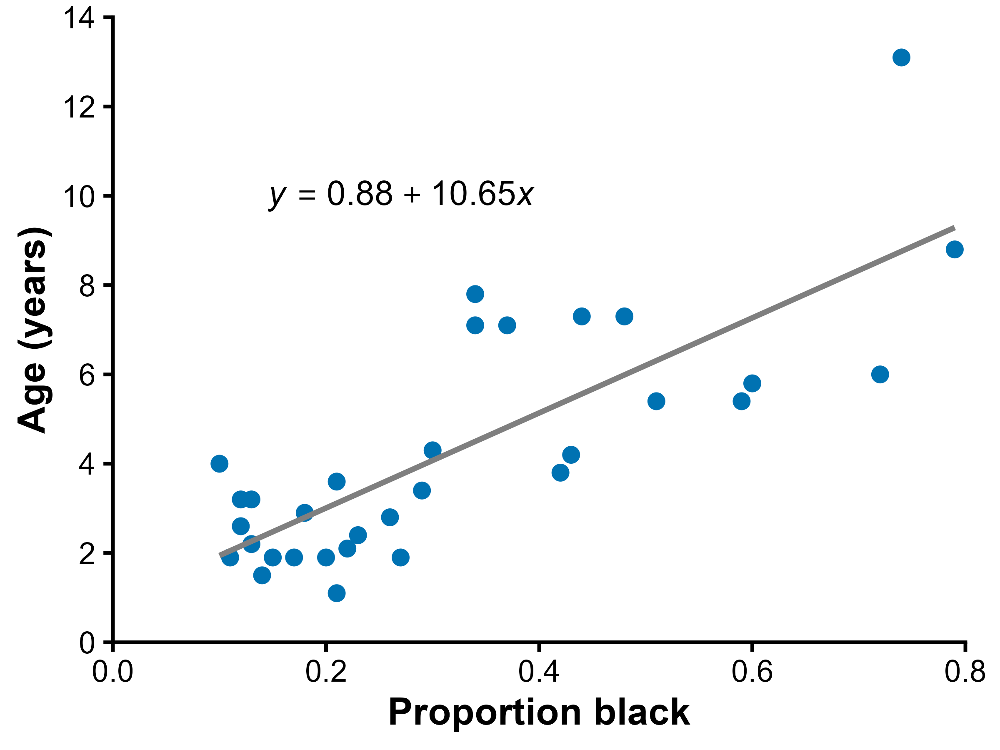
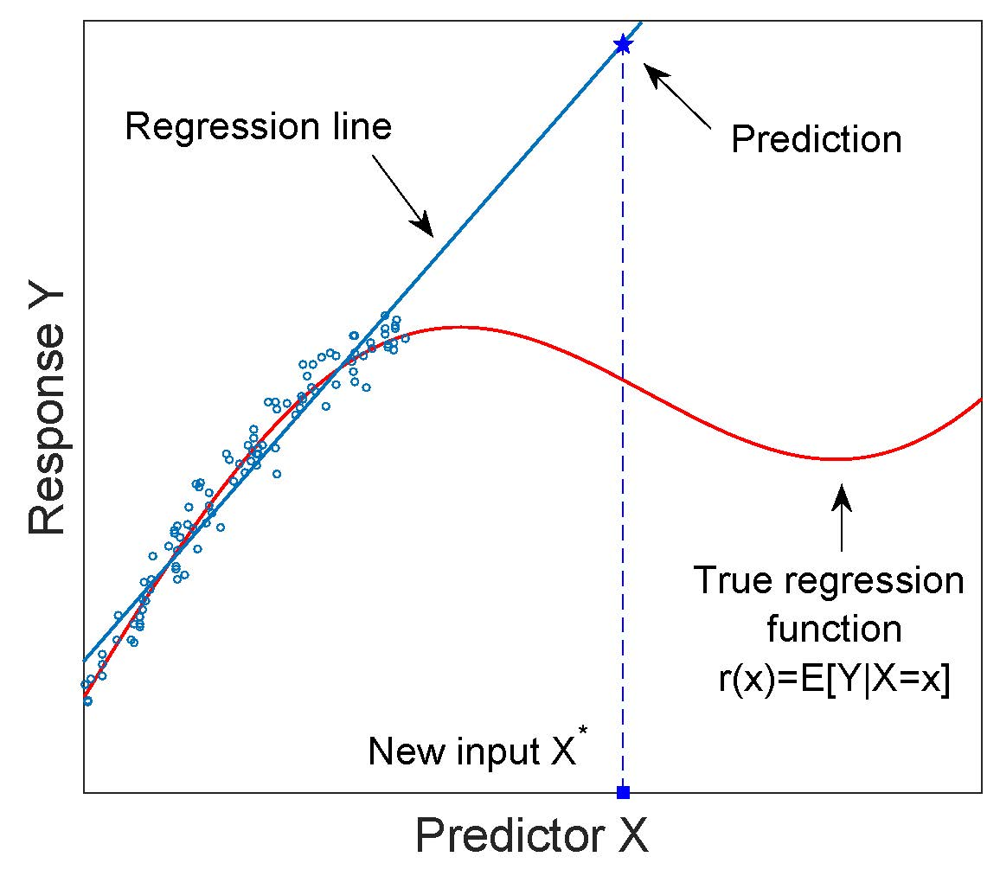
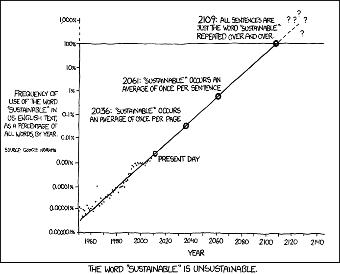

## Learning Objectives

-   Identify the explanatory variable and response variable in a regression study.
-   Recognize when a scatterplot suggests an approximately linear relationship.
-   Explain how the least squares regression line summarizes the relationship between two variables.
-   Interpret the slope of a regression line in context.
-   Use a regression equation to calculate and interpret predicted values within the observed data range.
-   Explain why predictions made beyond the observed range of the data can be unreliable.

## What is regression?

-   [Regression]{.keyword} is used to predict values of one numerical variable from values of another numerical variable.

-   A regression line summarizes the relationship between two variables in a scatter plot.

-   It can be used to estimate the expected value of a response variable from an explanatory variable.

-   In this chapter, we focus on [linear regression]{.keyword}, where the relationship is described by a straight line.

## Regression example

::::: columns
::: {.column width="50%"}
-   Genetic diversity in human populations is related to distance from East Africa.

-   A fitted line can be used to predict expected genetic diversity from migration distance.

-   The downward slope suggests diversity decreases as distance increases.

{#fig-skulls fig-alt="Black-and-white photograph showing two views of a reconstructed fossil human skull from Herto, Ethiopia. The left image shows a side view with an elongated cranial vault and facial bones; the right image shows a front view with missing portions and visible reconstruction gaps. The specimen is displayed against a dark background." fig-align="center" width="397"}
:::

::: {.column width="50%"}
{#fig-human-genetic-diversity-vs-geography fig-alt="Scatter plot of human populations showing geographic distance from East Africa on the x-axis and genetic diversity (Hs) on the y-axis. Populations are colored by region: Africa, Europe, Asia, Middle East, Oceania, and the Americas. Most African populations cluster at short distances with high diversity near 0.78, while populations farther from East Africa, especially in the Americas, show lower diversity. A downward sloping regression line indicates decreasing diversity with increasing distance."}
:::
:::::

## Regression vs correlation

-   Both methods describe relationships between two numerical variables.

-   **Correlation** measures strength and direction of association.

-   **Regression** fits an equation to predict one variable from another.

-   Regression also measures how much the response changes when the explanatory variable changes.

## Two variables in regression

::::: columns
::: {.column width="50%"}
-   **Response variable (**$Y$): the outcome we want to predict.

-   **Explanatory variable (**$X$): the variable used to explain or predict $Y$.

-   In scatter plots for regression:

    -   $X$ is placed on the horizontal axis.
    -   $Y$ is placed on the vertical axis.
:::

::: {.column width="50%"}
```{r}
#| label: fig-x-y-axes
#| fig-cap: Axes used in regression scatterplots, with the explanatory variable on the horizontal axis and the response variable on the vertical axis.
#| fig-alt: Blank scatterplot with no plotted data points. The horizontal axis is labeled X (Explanatory Variable), and the vertical axis is labeled Y (Response Variable), illustrating the standard axis arrangement used in regression.

library(ggplot2)
library(tibble)

set.seed(275)

p <-
  tibble(
    x = 1:8 + rnorm(8, 0, .5), 
    y = 1:8 + rnorm(8, 0, 1)
  ) |> 
  ggplot(aes(x, y)) +
  labs(
    x = "X (Explanatory Variable)",
    y = "Y (Response Variable)"
  ) +
  theme_classic(base_size = 28) +
  theme(
    axis.ticks = element_blank(),
    axis.text = element_blank()
  )
p
```
:::
:::::

## Study designs for regression

-   Regression can be used with observational data.

-   Example: randomly sample individuals and measure both $X$ and $Y$.

-   Regression can also be used in experiments.

-   Example: choose treatment levels of $X$, then measure response $Y$.

## [Linear regression]{.keyword}

::::: columns
::: {.column width="50%"}
-   The most common type of regression is **linear regression**.

-   It fits a straight line through data to predict $Y$ from $X$.

-   A key assumption is that the true relationship is approximately linear.

-   If the relationship is strongly curved, a straight line may be inappropriate.
:::

::: {.column width="50%"}
```{r}
#| label: fig-scatterplot-example
#| fig-cap: Example scatterplot showing a positive linear relationship between an explanatory variable and a response variable, with a fitted regression line.
#| fig-alt: Scatterplot with eight red data points rising from lower left to upper right. The horizontal axis is labeled X (Explanatory Variable) and the vertical axis is labeled Y (Response Variable). A gray straight line passes through the points, indicating a positive linear trend with modest scatter around the line.

p +
  geom_smooth(color = "gray50", linetype = "solid", linewidth = 1.5,
              method = "lm", formula = y ~ x, se = FALSE) +
  geom_point(color = "#0072B2", size = 6) +
  scale_x_continuous(expand = expansion(mult = 0, add = .8)) +
  scale_y_continuous(expand = expansion(mult = 0, add = 1.5)) 
  
```
:::
:::::

## Example 17.1: The lion's nose

::::: columns
::: {.column width="50%"}
-   Managers want to estimate the ages of male lions.

-   Older males may be removed with less disruption than younger males.

-   Black pigmentation on the nose increases with age.

-   We use proportion black on the nose to predict age.
:::

::: {.column width="50%"}
{#fig-lion-photo fig-align="center" width="688"}
:::
:::::

## Lion data

::::: columns
::: {.column width="50%"}
-   Data from 32 male lions of known age.

-   $X$ = proportion black on the nose.

-   $Y$ = age (years).

-   A scatter plot is the first step.
:::

::: {.column width="50%"}
```{r}
#| label: fig-lion-nose-scatter
#| fig-cap: Age of 32 male lions plotted against the proportion of black pigmentation on the nose. Data from Whitlock & Schluter 3e.
#| fig-alt: Scatterplot of lion age in years versus proportion black on the nose. Points show individual lions, with ages generally increasing as nose pigmentation increases.

library(tidyverse)

lion_noses <- read_csv("data/chap17e1LionNoses.csv", show_col_types = FALSE)

lion_scatterplot <- 
  ggplot(lion_noses, aes(x = proportionBlack, y = ageInYears)) +
  geom_point(size = 3.5, color = "#0072B2") +
  scale_x_continuous(
    limits = c(0, 0.8),
    breaks = c(0, 0.2, 0.4, 0.6, 0.8),
    expand = 0
  ) +
  scale_y_continuous(
    limits = c(0, 14),
    breaks = seq(0, 14, by = 2),
    expand = 0
  ) +
  labs(
    x = "Proportion black",
    y = "Age (years)"
  ) +
  theme_classic(base_size = 22) +
  theme(
    axis.title = element_text(face = "bold"),
    plot.margin = margin(10, 20, 10, 10)
  )
lion_scatterplot
```
:::
:::::

## The method of least squares

-   Many lines can be drawn through a scatter plot.

-   We need a rule for choosing the **best** line.

-   Least squares chooses the line with the smallest total squared vertical deviations from the points.

-   These vertical deviations are called **residuals**.

## Comparing possible lines

-   Poorly chosen lines have large deviations from the data.

-   Better lines have smaller deviations.

-   The least squares line minimizes the sum of squared deviations.

```{r}
#| label: fig-lion-candidate-lines
#| fig-cap: Lion age data shown with three candidate regression lines that produce large, smaller, and smallest vertical deviations from the observed points.
#| fig-alt: Three-panel figure using the same lion age data in each panel. Each panel shows age in years versus proportion black on the nose, a candidate straight line, and vertical segments from each point to the line. The left panel has a poorly fitting line with large deviations, the middle panel has a line with smaller deviations, and the right panel has the least-squares line with the smallest deviations overall.
#| fig-height: 6
#| fig-width: 18

library(tidyverse)

lion_noses <- read_csv("data/chap17e1LionNoses.csv")

# Fit the least-squares line
fit <- lm(ageInYears ~ proportionBlack, data = lion_noses)
a_best <- coef(fit)[1]
b_best <- coef(fit)[2]

# Define three candidate lines
line_specs <- tibble(
  panel = c("Large deviations", "Smaller deviations", "Smallest deviations"),
  intercept = c(6.0, 2.6, a_best),
  slope = c(-6.8, 4.2, b_best)
)

# Repeat the same data in each facet and calculate fitted values
plot_dat <- lion_noses %>%
  crossing(line_specs) %>%
  mutate(
    yhat = intercept + slope * proportionBlack,
    panel = factor(
      panel,
      levels = c("Large deviations", "Smaller deviations", "Smallest deviations")
    )
  )

# Endpoints for drawing each candidate line
line_dat <- line_specs %>%
  mutate(
    x1 = 0.1,
    x2 = 0.8,
    y1 = intercept + slope * x1,
    y2 = intercept + slope * x2,
    panel = factor(
      panel,
      levels = c("Large deviations", "Smaller deviations", "Smallest deviations")
    )
  )

ggplot(plot_dat, aes(x = proportionBlack, y = ageInYears)) +
  geom_segment(
    aes(
      xend = proportionBlack,
      y = yhat,
      yend = ageInYears
    ),
    linewidth = 0.6,
    color = "gray20"
  ) +
  geom_segment(
    data = line_dat,
    aes(x = x1, y = y1, xend = x2, yend = y2),
    inherit.aes = FALSE,
    linewidth = 1.2,
    color = "gray15"
  ) +
  geom_point(size = 3.2, color = "#0072B2") +
  facet_wrap(~panel, nrow = 1) +
  scale_x_continuous(
    limits = c(0, 0.8),
    breaks = c(0, 0.2, 0.4, 0.6, 0.8)
  ) +
  scale_y_continuous(
    limits = c(0, 14),
    breaks = seq(0, 14, by = 2)
  ) +
  labs(
    x = "Proportion black",
    y = "Age (years)"
  ) +
  theme_classic(base_size = 28) +
  theme(
    axis.title = element_text(face = "bold"),
    strip.background = element_blank(),
    strip.text = element_text(face = "bold"),
    panel.spacing = unit(2, "lines"),
    plot.margin = margin(10, 10, 10, 10)
  )
```

## Why square the deviations?

-   Points above the line have positive residuals.

-   Points below the line have negative residuals.

-   If we simply added deviations, positives and negatives could cancel.

-   Squaring avoids cancellation and gives more weight to large errors.

## Formula for the line

-   A regression line is written as:

$$
Y = a + bX
$$

-   $a$ is the **intercept**.

-   $b$ is the **slope**.

-   Together, they determine the location and tilt of the line.

## The intercept and slope

::::: columns
::: {.column width="50%"}
-   [Intercept]{.keyword} : the predicted value of $Y$ when $X = 0$

    -   Where the line crosses the $y$-axis
    -   Units are same as response variable

-   [Slope]{.keyword} : the change in $Y$ for a one-unit increase in $X$.

    -   Positive slope: larger $X$ predicts larger $Y$.
    -   Negative slope: larger $X$ predicts smaller $Y$.
    -   Zero slope: no linear trend.
    -   The **rate of change in** $Y$ per unit of $X$.
:::

::: {.column width="50%"}
```{r}
#| label: fig-slope-intercept-examples
#| fig-cap: Example scatterplots showing positive, negative, and zero slopes, and a comparison of higher and lower intercepts.
#| fig-alt: Four-panel figure. The first panel shows points around an upward sloping line labeled b positive. The second shows points around a downward sloping line labeled b negative. The third shows points around a horizontal line labeled b = 0. The fourth shows two parallel upward sloping lines labeled a higher and a lower, with filled points for the higher intercept and open points for the lower intercept.

library(tidyverse)

theme_set(theme_classic(base_size = 22))

# Panel 1: positive slope
dat_pos <- tibble(
  panel = "b positive",
  x = c(0.8, 1.4, 2.2, 3.0, 3.8, 4.6, 5.4, 6.2, 7.0),
  y = c(0.6, 1.0, 1.8, 1.6, 3.2, 3.3, 3.8, 3.2, 4.4)
)

line_pos <- tibble(
  panel = "b positive",
  x = c(0.8, 7.0),
  y = c(0.6, 4.1)
)

# Panel 2: negative slope
dat_neg <- tibble(
  panel = "b negative",
  x = c(0.8, 1.5, 2.2, 3.0, 3.8, 4.6, 5.4, 6.2, 7.0),
  y = c(4.4, 3.7, 3.1, 2.9, 1.7, 1.5, 3.0, 0.9, 1.0)
)

line_neg <- tibble(
  panel = "b negative",
  x = c(0.8, 7.0),
  y = c(4.0, 0.6)
)

# Panel 3: zero slope
dat_zero <- tibble(
  panel = "b = 0",
  x = c(0.8, 1.5, 2.2, 3.8, 4.5, 5.2, 5.9, 6.7, 3.0),
  y = c(3.0, 3.1, 2.8, 2.95, 2.85, 2.8, 2.5, 2.6, 1.8)
)

line_zero <- tibble(
  panel = "b = 0",
  x = c(0.8, 6.8),
  y = c(2.75, 2.75)
)

# Panel 4: higher and lower intercept
dat_hi <- tibble(
  panel = "intercepts",
  x = c(0.8, 1.5, 2.2, 3.0, 3.8, 4.6, 5.4, 6.2, 7.0),
  y = c(2.0, 2.2, 2.6, 2.5, 3.4, 3.5, 3.8, 3.4, 4.2),
  group = "higher"
)

dat_lo <- tibble(
  panel = "intercepts",
  x = c(0.8, 1.5, 2.2, 3.0, 3.8, 4.6, 5.4, 6.2, 7.0),
  y = c(0.6, 0.8, 1.2, 1.1, 1.9, 2.0, 2.2, 1.9, 2.5),
  group = "lower"
)

line_hi <- tibble(
  panel = "intercepts",
  x = c(0.8, 7.0),
  y = c(2.0, 4.0)
)

line_lo <- tibble(
  panel = "intercepts",
  x = c(0.8, 7.0),
  y = c(0.6, 2.3)
)

# Base panels
p1 <- ggplot(dat_pos, aes(x, y)) +
  geom_segment(
    data = line_pos,
    aes(x = x[1], y = y[1], xend = x[2], yend = y[2]),
    inherit.aes = FALSE,
    linewidth = 1.2
  ) +
  geom_point(size = 3, color = "#0072B2") +
  annotate("text", x = 3.3, y = 4.2, label = "italic(b)~positive", parse = TRUE, size = 8) +
  labs(x = "X", y = "Y") +
  coord_cartesian(xlim = c(0.2, 7.5), ylim = c(0.2, 7)) +
  theme(
    axis.text = element_blank(),
    axis.ticks = element_blank(),
    axis.title = element_text(face = "bold")
  )

p2 <- ggplot(dat_neg, aes(x, y)) +
  geom_segment(
    data = line_neg,
    aes(x = x[1], y = y[1], xend = x[2], yend = y[2]),
    inherit.aes = FALSE,
    linewidth = 1.2
  ) +
  geom_point(size = 3, color = "#0072B2") +
  annotate("text", x = 3.7, y = 4.4, label = "italic(b)~negative", parse = TRUE, size = 8) +
  labs(x = "X", y = "Y") +
  coord_cartesian(xlim = c(0.2, 7.5), ylim = c(0.2, 7)) +
  theme(
    axis.text = element_blank(),
    axis.ticks = element_blank(),
    axis.title = element_text(face = "bold")
  )

p3 <- ggplot(dat_zero, aes(x, y)) +
  geom_segment(
    data = line_zero,
    aes(x = x[1], y = y[1], xend = x[2], yend = y[2]),
    inherit.aes = FALSE,
    linewidth = 1.2
  ) +
  geom_point(size = 3, color = "#0072B2") +
  annotate("text", x = 3.8, y = 4.2, label = "italic(b)==0", parse = TRUE, size = 8) +
  labs(x = "X", y = "Y") +
  coord_cartesian(xlim = c(0.2, 7.5), ylim = c(0.2, 7)) +
  theme(
    axis.text = element_blank(),
    axis.ticks = element_blank(),
    axis.title = element_text(face = "bold")
  )

p4 <- ggplot() +
  geom_segment(
    data = line_hi,
    aes(x = x[1], y = y[1], xend = x[2], yend = y[2]),
    linewidth = 1.2
  ) +
  geom_segment(
    data = line_lo,
    aes(x = x[1], y = y[1], xend = x[2], yend = y[2]),
    linewidth = 1.2
  ) +
  geom_point(
    data = dat_hi,
    aes(x, y),
    size = 3,
    color = "#0072B2"
  ) +
  geom_point(
    data = dat_lo,
    aes(x, y),
    size = 3,
    shape = 21,
    stroke = 1.2,
    color = "#0072B2",
    fill = "white"
  ) +
  annotate("text", x = 2.0, y = 4.2, label = "italic(a)~higher", parse = TRUE, size = 8) +
  annotate("text", x = 6, y = 0.5, label = "italic(a)~lower", parse = TRUE, size = 8) +
  labs(x = "X", y = "Y") +
  coord_cartesian(xlim = c(0.2, 7.5), ylim = c(0.2, 7)) +
  theme(
    axis.text = element_blank(),
    axis.ticks = element_blank(),
    axis.title = element_text(face = "bold")
  )

library(patchwork)

p1 + p2 + p3 + p4 + plot_layout(axis_titles = "collect")
```
:::
:::::

## Calculating the slope

-   For a sample, the least squares slope is:

$$
b = \frac{\sum (X_i - \bar{X})(Y_i - \bar{Y})}{\sum (X_i - \bar{X})^2}
$$

-   The numerator measures whether $X$ and $Y$ tend to increase or decrease together.
-   The denominator measures how much the $X$ values vary.
-   Their ratio determines the slope of the fitted regression line.

## Calculating the intercept

-   Once the slope is known, the intercept can be calculated as:

$$
a = \bar{Y} - b\bar{X}
$$

-   The fitted regression line always passes through the point:

$$
(\bar{X}, \bar{Y})
$$

-   This means the line passes through the sample means of $X$ and $Y$.

## Lion regression equation

::::: columns
::: {.column width="50%"}
-   For the lion data, the fitted line is approximately:

$$ \hat{Y} = 0.88 + 10.65X $$

-   Equivalent interpretation:

$$ \widehat{\text{Age}} = 0.88 + 10.65(\text{proportion black}) $$
:::

::: {.column width="50%"}
```{r}
#| label: fig-lion-regression-line
#| fig-cap: Lion age plotted against the proportion of black pigmentation on the nose, with the fitted linear regression line and equation.
#| fig-alt: Scatterplot of lion age in years versus proportion black on the nose. Blue points represent individual lions. A gray upward sloping regression line is shown, with the equation y = 0.88 + 10.65x displayed inside the plot. Ages tend to increase as nose pigmentation increases.

lion_scatterplot +
  geom_smooth(method = "lm", formula = y ~ x, se = FALSE, 
              color = "gray50", linewidth = 1.5) +
  annotate("text", x = 0.27, y = 10, size = 7, parse = TRUE,
           label = "italic(y) == 0.88 + 10.65*italic(x) ")
ggsave("images/lion-regression-line.png", width = 8, height = 6)
```
:::
:::::

## Interpreting the lion slope

::::: columns
::: {.column width="50%"}
-   Each 1.0 increase in proportion black predicts about 10.65 more years of age.

-   More practically, a 0.10 increase predicts about:

    $$ 10.65 \times 0.10 = 1.065 $$

    years older on average.
:::

::: {.column width="50%"}
{fig-align="center" width="84.2%"}
:::
:::::

## Lion fitted line

::::: columns
::: {.column width="50%"}
-   The line summarizes the average trend.

-   Individual lions vary around the line.

-   Not every point falls exactly on the prediction line.
:::

::: {.column width="50%"}
{fig-align="center" width="84.2%"}
:::
:::::

## Populations and samples

-   The fitted line from data is a **sample estimate**.

-   We use it to estimate the true regression line in the population.

-   Population form:

$$
Y = \alpha + \beta X
$$

-   Sample estimates:

    -   $a$ estimates $\alpha$
    -   $b$ estimates $\beta$

## Predicted values

-   A predicted value lies on the regression line.

-   We use:

    $$
    \hat{Y}
    $$

    for a prediction.

-   $\hat{Y}$ estimates the **mean response** for all individuals with a given $X$ value.

## Lion prediction example

-   Predict age when proportion black is $X = 0.50$:

$$
\hat{Y} = 0.88 + 10.65(0.50) = 6.2
$$

-   Lions with $X = 0.50$ are predicted to average about 6.2 years old.

## Use caution with prediction

:::::: columns
::: {.column width="66%"}
-   Predictions most reliable within the observed range of $X$ values

-   Predicting far outside the data range is called **extrapolation**

-   May misleading because relationship may change beyond sampled data

{#fig-extrapolation-problem fig-alt="Diagram showing observed data clustered on the left side of a scatterplot, with a fitted blue linear regression line closely matching the data range. A red curved line represents the true underlying relationship. Far to the right, a new predictor value X* is outside the observed data range. The blue regression line gives a high predicted response there, while the red true curve is much lower, illustrating how extrapolation beyond the data can lead to inaccurate predictions." fig-align="center" width="514"}
:::

:::: {.column width="33%"}
::: {#fig-extrapolation-cartoons layout-ncol="1"}
{fig-align="center" width="400"}

{fig-align="center" width="400"}

Very serious examples of extrapolation gone awry. Images: xkcd (CC BY-NC 2.5)
:::
::::
::::::

## Summary

-   Regression predicts one numerical variable from another.

-   Linear regression fits the least squares line:

$$
\hat{Y} = a + bX
$$

-   Slope describes rate of change.

-   Intercept gives predicted $Y$ when $X=0$.

-   Predictions are strongest within the data range.
