## Learning Objectives

-   Explain how linear models extend regression to analyze multiple explanatory variables
-   Distinguish between numerical and categorical predictors and interpret common model terms such as main effects, interactions, blocks, and covariates
-   Explain how factorial designs, blocking, and ANCOVA are represented in linear models
-   Interpret F-tests used to evaluate whether adding a term improves model fit
-   Evaluate model assumptions using residual plots and other graphical displays
-   Explain why interaction terms and design-related variables should be removed cautiously

# Linear Models

## Why studies often include multiple factors

::::: columns
::: {.column width="50%"}
-   Many studies measure more than one explanatory variable

-   Real biological systems are influenced by multiple causes

-   Can test several questions using one dataset

-   Can reduce bias by accounting for other variables

-   Examples:

    -   fertilizer and sunlight on plant growth
    -   habitat and sex on body mass
    -   treatment while adjusting for age
:::

::: {.column width="50%"}
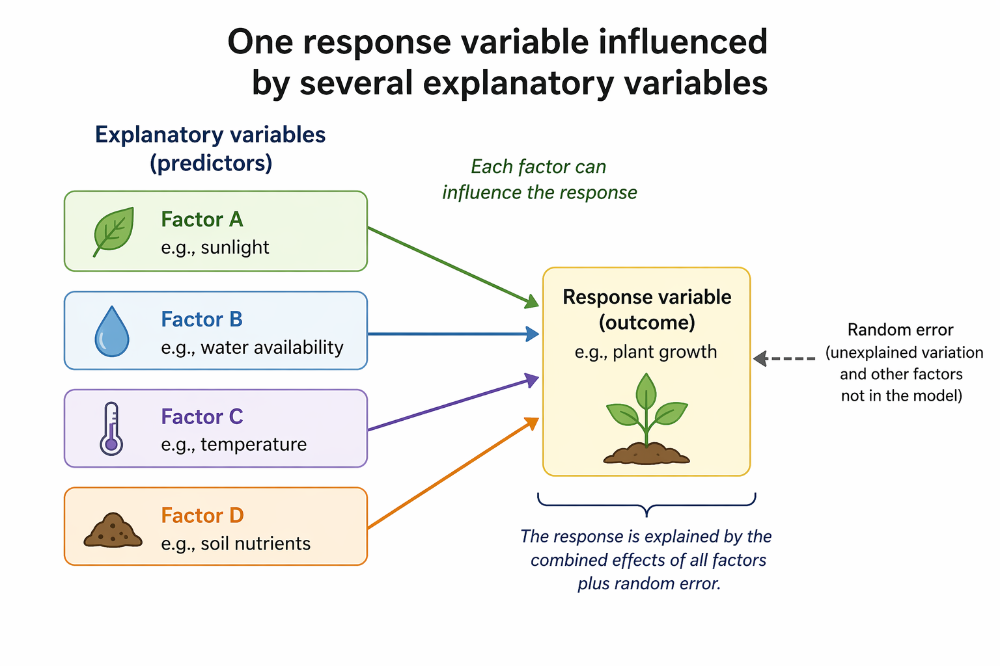{#fig-multiple-factors-concept fig-alt="Diagram with four explanatory variables on the left (sunlight, water availability, temperature, and soil nutrients) shown as separate boxes with arrows pointing to one response variable on the right labeled plant growth. A dashed arrow labeled random error also points to the response, indicating unexplained variation outside the model." fig-align="center"}
:::
:::::

## Linear models provide one common framework

::::: columns
::: {.column .normal-eq-column width="50%"}
-   Many methods are versions of the same idea
-   A [linear model]{.keyword} relates a numerical response to one or more explanatory variables
-   General form:

$$
\text{Response} = \text{systematic effects} +\\ \text{random error}
$$

-   Includes:
    -   regression
    -   ANOVA
    -   ANCOVA
    -   multiple regression
:::

::: {.column width="50%"}
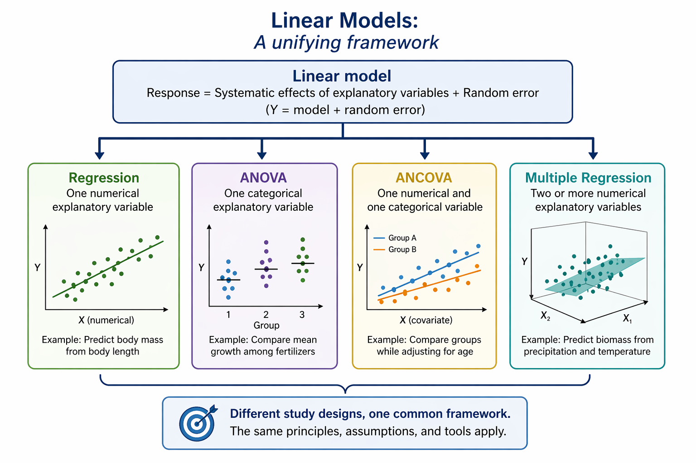{#fig-linear-model-framework fig-alt="Flowchart with a central box labeled Linear Models connected to four branches: Regression, ANOVA, ANCOVA, and Multiple Regression. Each branch includes a small example graph and notes the type of explanatory variables used: one numerical predictor for regression, one categorical predictor for ANOVA, one numerical plus one categorical predictor for ANCOVA, and two or more numerical predictors for multiple regression."}
:::
:::::

## Regression and ANOVA are closely related

::::: columns
::: {.column width="50%"}
-   Both analyze a numerical response variable

-   Both compare a model with a simpler null model

-   Both use residual variation to judge fit

-   Main difference is predictor type:

-   [Regression]{.keyword}

    -   **numerical** explanatory variable

-   [ANOVA]{.keyword}

    -   **categorical** explanatory variable
:::

::: {.column width="50%"}
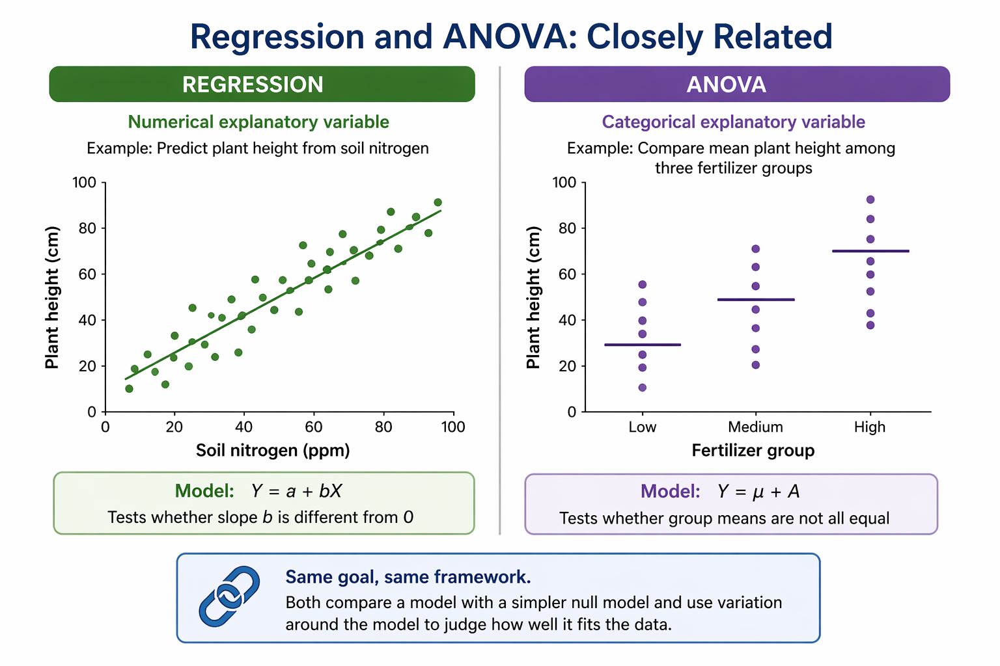{#fig-regression-vs-anova fig-alt="Two-panel graphic comparing regression and ANOVA. Left panel shows a scatterplot of plant height versus soil nitrogen with an upward sloping regression line, representing a numerical explanatory variable. Right panel shows three fertilizer groups (Low, Medium, High) with individual data points and horizontal mean lines, representing a categorical explanatory variable. Both panels emphasize that each method fits a model to explain variation in a numerical response."}
:::
:::::

## Regression model example

::::: columns
::: {.column width="50%"}
-   Predict exam score from study hours

$$
Y = a + bX
$$

-   $a$ = intercept

-   $b$ = slope

-   $X$ = explanatory variable

-   $Y$ = predicted response
:::

::: {.column width="50%"}
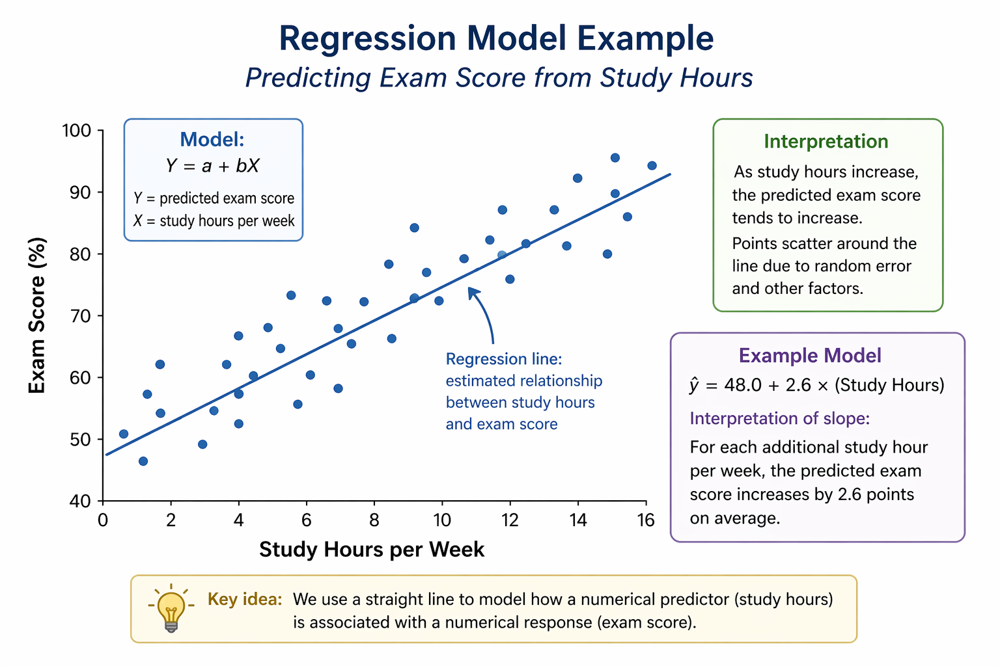{#fig-regression-example fig-alt="Scatterplot with study hours per week on the horizontal axis and exam score percent on the vertical axis. Individual points show students with varying scores, and an upward sloping regression line runs through the cloud of points, indicating that students who study more hours generally earn higher exam scores."}
:::
:::::

## ANOVA model example

::::: columns
::: {.column width="50%"}
-   Compare mean growth among fertilizer groups

$$
Y = \mu + A
$$

-   $\mu$ = grand mean

-   $A$ = group effect

-   Tests whether group means differ
:::

::: {.column width="50%"}
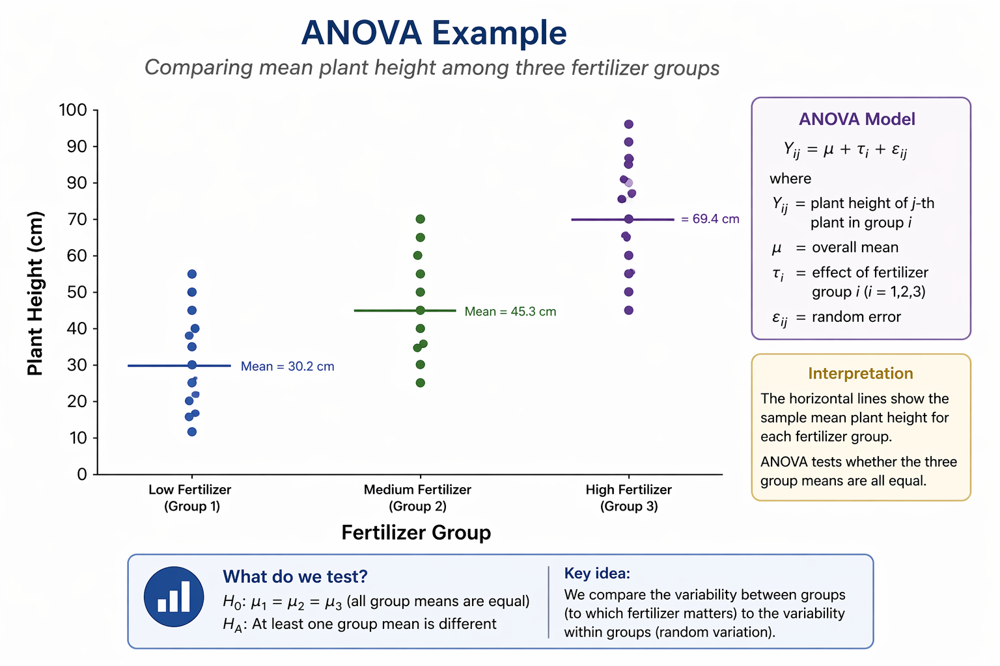{#fig-anova-example fig-alt="Dotplot with fertilizer group on the horizontal axis (Low, Medium, High) and plant height in centimeters on the vertical axis. Each group contains multiple plant height observations shown as dots. Horizontal lines across each group indicate the sample mean, with higher average height in the High fertilizer group than in the Medium and Low groups."}
:::
:::::

## Model statements in words

::::: columns
::: {.column .normal-eq-column width="50%"}
-   We often describe models using variable names

-   Example:

$$
GROWTH = CONSTANT + \\ FERTILIZER
$$

-   Easier to read than symbols
-   Highlights study design
-   Common in software formulas and output
:::

::: {.column width="50%"}
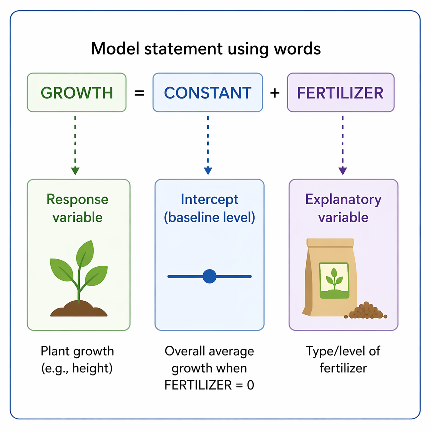{#fig-model-statement fig-alt="Diagram titled Model statement using words showing GROWTH = CONSTANT + FERTILIZER across the top. Arrows point downward from each term to labeled boxes explaining their roles: GROWTH as the response variable with a plant icon, CONSTANT as the intercept or baseline level, and FERTILIZER as the explanatory variable with a fertilizer bag icon. Additional text notes plant growth as an example response and fertilizer type or level as the predictor." fig-align="center" width="80%"}
:::
:::::

## Multiple-factor model statements

::::: columns
::: {.column .normal-eq-column width="50%"}
Two predictors:

$$
RESPONSE = CONSTANT \\ + A + B
$$

With interaction:

$$
RESPONSE = CONSTANT \\ + A + B + A \times B
$$

$A \times B$ means the effect of one variable depends on the other
:::

::: {.column width="50%"}
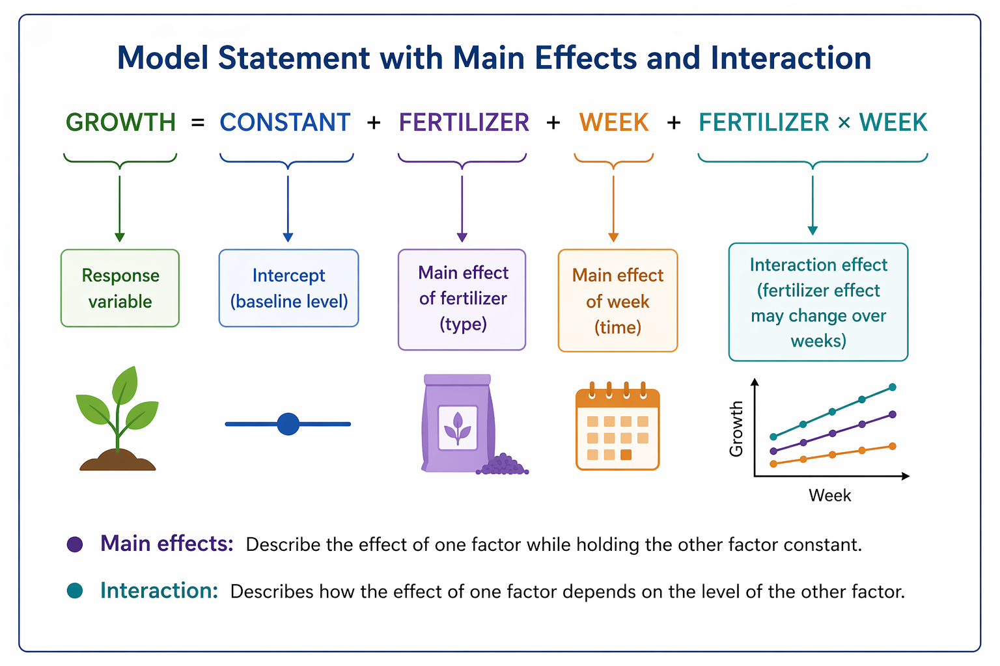{#fig-model-statement-interactions fig-alt="Diagram centered on the model statement GROWTH = CONSTANT + FERTILIZER + WEEK + FERTILIZER × WEEK. Colored labels identify each component: response variable, intercept, main effect of fertilizer, main effect of week, and interaction effect. Icons and arrows connect terms to explanations, and a small graph shows different growth lines over time to illustrate that the fertilizer effect changes across weeks."}
:::
:::::

## Common analyses are all linear models

| Linear Model | Other name | Example study design |
|------------------------------|---------------------|---------------------|
| $Y = \mu + X$ | Linear regression | Dose-response |
| $Y = \mu + A$ | One-way (single-factor) ANOVA | Completely randomized |
| $Y = \mu + A + b$ | Two-way, fixed-effect ANOVA | Randomized block |
| $Y = \mu + A + B + A*B$ | Two-way fixed-effects ANOVA | Factorial experiment |
| $Y = \mu + A + b + A*b$ | Two-way mixed-effects ANOVA | Factorial experiment |
| $Y = \mu + X + A$ | ANCOVA | Observational study |
| $Y = \mu + X_1 + X_2 + X_1*X_2$ | Multiple regression | Dose-response |

$\mu$ is a constant, $Y$ is the numerical response variable, $X$ is a numerical explanatory variable, $A$ and $B$ are fixed, categorical variables; $b$ is a blocking or other random-effect categorical variable

# Comparing Models

## Comparing models with the F-test

::::: columns
::: {.column width="50%"}
-   Many questions ask whether adding a variable improves the model

-   We compare:

    -   [Null model]{.keyword}\
        simpler model without the term

    -   [Full model]{.keyword}\
        includes the term of interest

-   If fit improves enough, the term may matter
:::

::: {.column width="50%"}
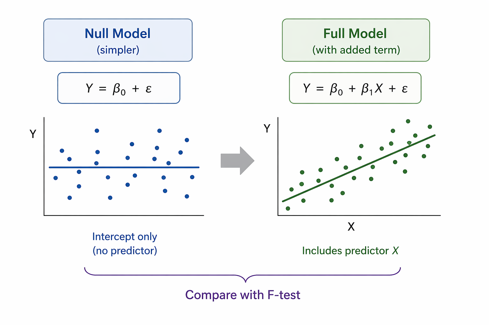{#fig-null-vs-full-model fig-alt="Two-panel diagram comparing statistical models. Left panel shows a null model with scattered points around a horizontal mean line, representing an intercept-only model with no predictor. Right panel shows a full model with points following an upward trend and a fitted regression line, representing a model that includes an explanatory variable. An arrow between panels indicates comparing the two models."}
:::
:::::

## Example: does fertilizer improve prediction?

::::: columns
::: {.column .normal-eq-column width="50%"}
-   Null model:

$$
GROWTH = CONSTANT
$$

-   Full model:

$$
GROWTH = CONSTANT + FERTILIZER
$$

-   Ask whether fertilizer explains additional variation in growth
:::

::: {.column width="50%"}
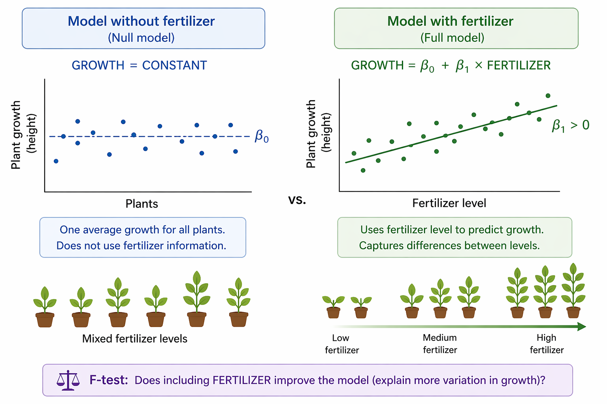{#fig-fertilizer-model-compare fig-alt="Two-panel diagram comparing models of plant growth. Left panel shows a null model with plant growth observations scattered around a single horizontal mean line, representing one average growth value for all plants regardless of fertilizer. Right panel shows a full model with an upward trend line relating fertilizer level to plant growth, indicating that higher fertilizer levels are associated with greater growth. Small plant icons below illustrate increasing plant size from low to high fertilizer."}
:::
:::::

## The [F-statistic]{.keyword} asks whether the fuller model fits better

::::: columns
::: {.column width="50%"}
-   Compare a simpler null model to a fuller model

-   Ask whether adding the new term improves fit enough to matter

-   Large F values suggest stronger evidence for improvement

-   Small F values suggest little improvement
:::

::: {.column width="50%"}
{#fig-fertilizer-model-compare-2 fig-alt="Two-panel diagram comparing models of plant growth. Left panel shows a null model with plant growth observations scattered around a single horizontal mean line, representing one average growth value for all plants regardless of fertilizer. Right panel shows a full model with an upward trend line relating fertilizer level to plant growth, indicating that higher fertilizer levels are associated with greater growth. Small plant icons below illustrate increasing plant size from low to high fertilizer."}
:::
:::::

## Interpreting the p-value

::::: columns
::: {.column width="50%"}
-   The p-value asks:

-   If the added term truly had no effect, how unusual is this F value?

-   Small p-value:

    -   evidence the added term improves the model

-   Large p-value:

    -   data are consistent with no meaningful improvement
:::

::: {.column width="50%"}
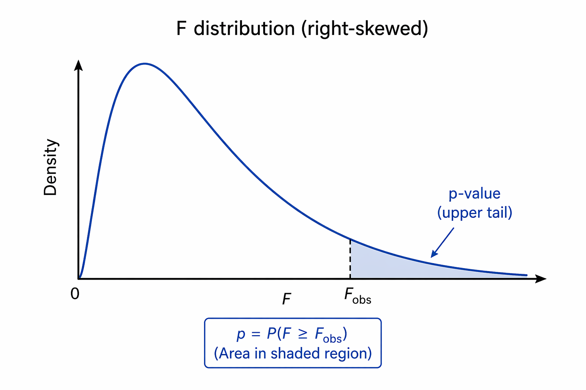{#fig-f-distribution-pvalue fig-alt="Graph of an F distribution with density on the vertical axis and F values on the horizontal axis. The curve rises quickly near zero and gradually tapers to the right, showing a right-skewed shape. A vertical dashed line marks the observed F-statistic, and the area under the curve to the right of that line is shaded to indicate the p-value."}
:::
:::::

# Analyzing experiments with blocking

## Blocking reduces background variation

::::: columns
::: {.column width="50%"}
-   Sometimes experimental units differ before treatment begins

-   Those pre-existing differences can add noise

-   [Blocking]{.keyword} groups similar units together

-   Treatments are then compared within each block

-   Goal: improve ability to detect treatment effects
:::

::: {.column width="50%"}

:::
:::::

## Randomized block design

::::: columns
::: {.column width="50%"}
-   A randomized block design is like a paired design with more than two treatments

-   Each block receives every treatment once

-   Example:

    -   5 lake locations = blocks

    -   3 fish abundance treatments per location

-   Compare treatments within location, not across mixed locations
:::

::: {.column width="50%"}

:::
:::::

## Zooplankton diversity experiment

::::: columns
::: {.column width="40%"}
-   Researchers tested whether fish abundance affects zooplankton diversity

-   Treatments:

    -   Control

    -   Low fish abundance

    -   High fish abundance

-   Five lake locations were used as blocks

-   Response variable: diversity index (Levin's $D$)
:::

::: {.column width="60%"}
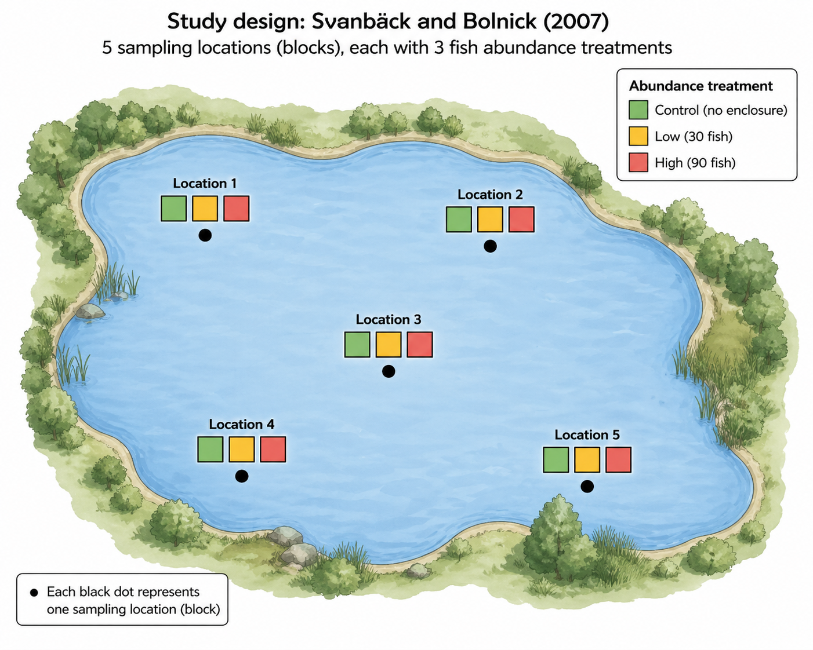{#fig-svanback-bolnick-study-design fig-alt="Top-down diagram of an irregularly shaped lake with five labeled sampling locations distributed around the lake. Each location contains three small colored squares representing fish abundance treatments: Control, Low, and High. A legend identifies the treatment colors. The figure illustrates a randomized block design in which every block receives all three treatments."}
:::
:::::

## Results of zooplankton diversity experiment

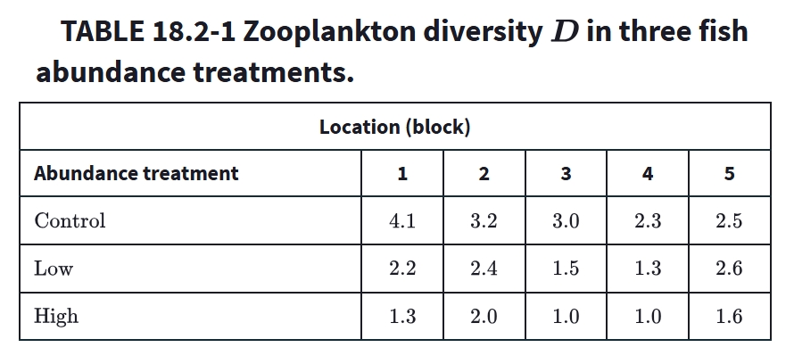{#tbl-abd-table-18.2-1 width="1600"}

## Why not use one-way ANOVA only?

::::: columns
::: {.column width="50%"}
-   Measurements from the same location are not independent

-   Conditions may differ among lake locations

-   Ignoring location mixes treatment effects with site differences

-   Include BLOCK in the model instead
:::

::: {.column width="50%"}
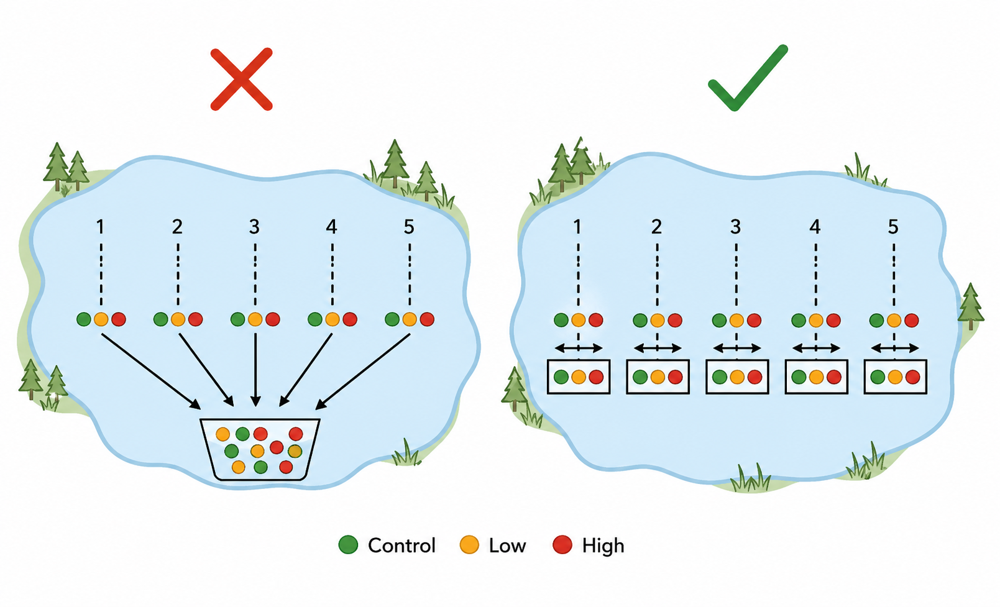{#fig-blocking-vs-ignore-location fig-alt="Two-panel diagram comparing analyses of a blocked experiment. Left panel shows five lake locations with treatment observations pooled into one mixed group, marked with a red X to indicate ignoring location. Right panel shows the same five locations with treatments compared separately within each location, marked with a green check to indicate blocking. Colored circles represent Control, Low, and High treatments."}
:::
:::::

## Model statements with and without blocking

-   Tests whether adding ABUNDANCE improves fit
-   If treatment matters, the full model fits better

::::: columns
::: {.column .normal-eq-column width="50%"}
### **Null model**

-   Separate averages for each block

$$
\begin{aligned}
\text{DIVERSITY} &= \text{CONSTANT} \\
&\quad + \text{BLOCK}
\end{aligned}
$$
:::

::: {.column .normal-eq-column width="50%"}
### **Full model**

-   Keeps blocks and adds treatment effects

$$
\begin{aligned}
\text{DIVERSITY} &= \text{CONSTANT} \\
&\quad + \text{BLOCK} \\
&\quad + \text{ABUNDANCE}
\end{aligned}
$$
:::
:::::

## Results from the $F$-test

::::: columns
::: {.column width="50%"}
-   Adding ABUNDANCE significantly improved model fit

-   Reported result:

    -   $F = 16.37$

        -   compares 2 nested models

        -   higher values = added term explains meaningful variation

    -   $P = 0.001$

-   Evidence that fish abundance affected zooplankton diversity
:::

::: {.column width="50%"}
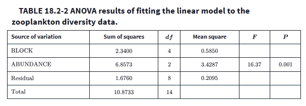{#tbl-abd-table-18.2-2 fig-alt="ANOVA table with rows for BLOCK, ABUNDANCE, Residual, and Total. Columns include sum of squares, degrees of freedom, mean square, F statistic, and P value. The ABUNDANCE row shows F = 16.37 and P = 0.001, indicating that fish abundance treatment significantly improved model fit after accounting for block differences among locations." width="100%"}
:::
:::::

## Interpreting the effect

::::: columns
::: {.column width="40%"}
-   Predicted values suggest:

    -   highest diversity in Control

    -   intermediate in Low

    -   lowest in High

-   More fish reduced zooplankton diversity in this experiment
:::

::: {.column width="60%"}
{#fig-abd-figure-18.2-1 fig-alt="Two-panel plot of zooplankton diversity by fish abundance treatment (Control, Low, High). Left panel shows the null model with separate horizontal mean lines for each of five lake locations, representing block effects only. Right panel shows the full model with predicted means that vary by treatment while retaining block differences. Symbols identify the five blocks. Diversity is generally highest in Control, intermediate in Low, and lowest in High treatments."}
:::
:::::

## Important principle about blocking

-   BLOCK is included because of study design

-   It is not the main biological question

-   Keep blocking variables in the model even if not significant

-   Blocking can still improve power

# Analyzing factorial designs

## Factorial designs study two factors at once

::::: columns
::: {.column width="50%"}
-   A [factorial design]{.keyword} includes all combinations of two or more explanatory variables

-   Each explanatory variable is a [factor]{.keyword}

-   Factors are treatments of direct interest

-   Allows us to test:

    -   [main effects]{.keyword}

    -   [interaction effects]{.keyword}
:::

::: {.column width="50%"}
{#fig-factorial-layout}
:::
:::::

## Two-factor linear model

::::: columns
::: {.column width="50%"}
-   General model:

$$
Y = CONSTANT + A + B + A*B
$$

-   $A$ and $B$ are main effects terms

-   $A*B$ is the interaction term
:::

::: {.column width="50%"}
{#fig-factorial-layout-2}
:::
:::::

## Main effects vs interaction

::::: columns
::: {.column width="50%"}
-   [Main effect]{.keyword}: average effect of one factor across levels of the other factor

-   [Interaction]{.keyword}: effect of one factor depends on the level of the other factor

-   In interaction plots:

    -   parallel lines suggest no interaction

    -   nonparallel lines suggest interaction
:::

::: {.column width="50%"}
{#fig-factorial-layout-3}
:::
:::::

## Intertidal algae experiment

::::: columns
::: {.column width="50%"}
-   Researchers tested effects of herbivores on algal cover

-   Two factors:

    -   Herbivory: Absent or Present

    -   Height: Low or Mid intertidal zone

-   Response: square-root algal surface area

-   Balanced design with all treatment combinations
:::

::: {.column width="50%"}
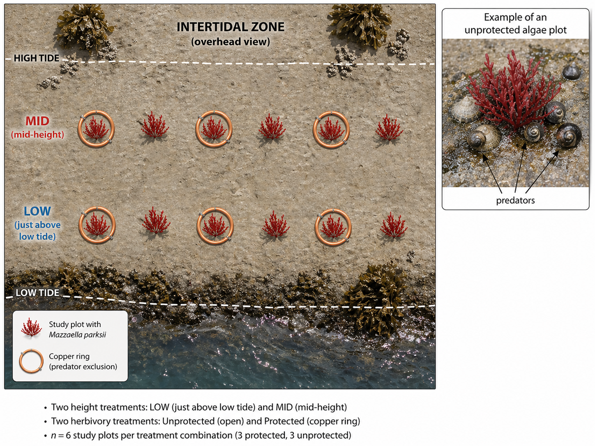{#fig-algae-study-design fig-alt="Overhead diagram of a rocky intertidal zone with dashed lines marking high tide and low tide. Six study plots are arranged at mid height between the tide lines and six plots are arranged just above the low tide line. Each plot is marked by a small red alga. Within each height treatment, three plots have copper rings around the algae indicating herbivore exclusion, and three plots have no ring. An inset shows an uncovered algae plot with limpets and snails labeled predators."}
:::
:::::

## Means suggest an interaction

::::: columns
::: {.column width="50%"}
-   At low height:

    -   herbivores greatly reduced algae

-   At mid height:

    -   herbivory had little effect

-   Suggests herbivory effect depends on height
:::

::: {.column width="50%"}
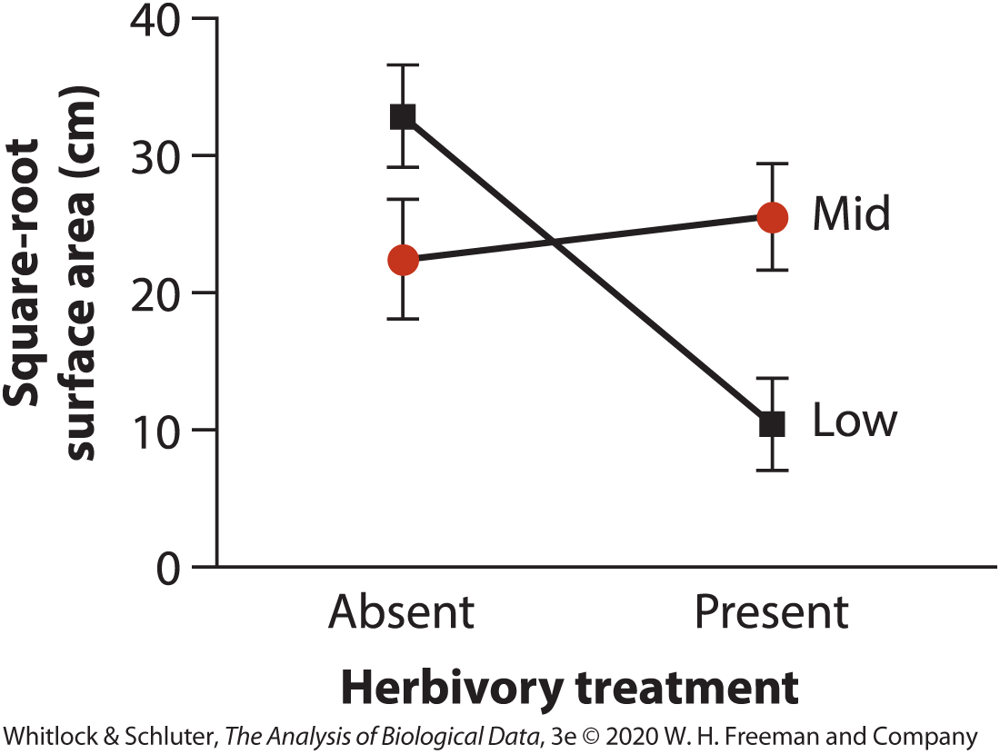{#fig-abd-figure-18.3-2 fig-alt="Interaction plot with herbivory treatment on the horizontal axis (Absent, Present) and square-root algal surface area on the vertical axis. One line for Low height declines sharply from about 33 when herbivores are absent to about 10 when present. A second line for Mid height rises slightly from about 22 to about 26. Error bars show standard errors. The nonparallel lines indicate an interaction between herbivory and height."}
:::
:::::

## Testing the interaction first

::::: columns
::: {.column .normal-eq-column width="50%"}
Compare two models:

-   Without interaction:

$$
\begin{aligned}
\text{ALGAE} &= \text{CONSTANT} \\
&\quad + \text{HERBIVORY} \\
&\quad + \text{HEIGHT}
\end{aligned}
$$

-   With interaction:

$$
\begin{aligned}
\text{ALGAE} &= \text{CONSTANT} \\
&\quad + \text{HERBIVORY} \\
&\quad + \text{HEIGHT} \\
&\quad + \text{HERBIVORY} * \text{HEIGHT}
\end{aligned}
$$
:::

::: {.column width="50%"}
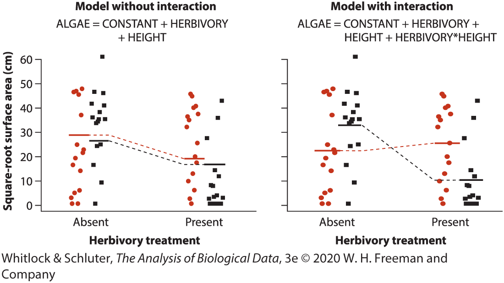{#fig-abd-figure-18.3-3 fig-alt="Two-panel graph of algal surface area by herbivory treatment. Left panel shows a model without interaction, where fitted lines for Low and Mid heights are parallel. Right panel shows a model with interaction, where one fitted line declines strongly and the other rises slightly, allowing different herbivory effects at different heights. Points show individual observations for the two height groups."}
:::
:::::

## ANOVA results

::::: columns
::: {.column width="50%"}
-   Interaction term was significant

    -   $F = 11.00$

    -   $P = 0.002$

-   Herbivory main effect also significant

-   Height main effect not significant alone
:::

::: {.column width="50%"}
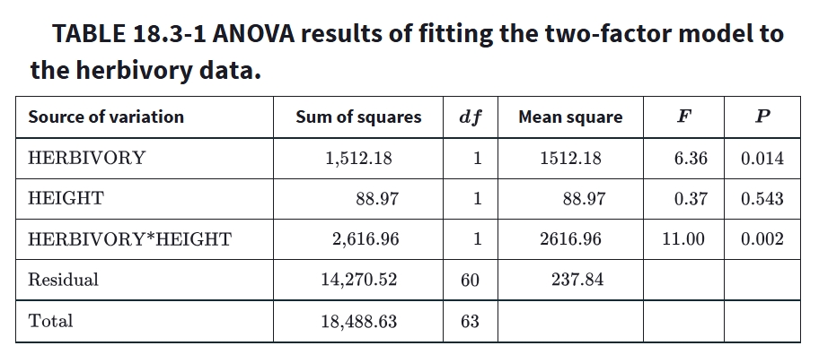{#tbl-abd-table-18.3-1 fig-alt="ANOVA table with rows for HEIGHT, HERBIVORY, HERBIVORY × HEIGHT, Residual, and Total. Columns include sum of squares, degrees of freedom, mean square, F statistic, and P value. HERBIVORY has a significant main effect with F = 39.08 and P < 0.0001. The interaction HERBIVORY × HEIGHT is also significant with F = 11.00 and P = 0.002, indicating that the effect of herbivory depended on shore height. HEIGHT alone is not statistically significant with P = 0.219."}
:::
:::::

## How to interpret a significant interaction

::::: columns
::: {.column width="50%"}
-   Main effects alone can be misleading when interaction is present

-   Height mattered because it changed the herbivory effect

-   Use graphs to describe the biological pattern
:::

::: {.column width="50%"}
{#fig-abd-figure-18.3-2-2}
:::
:::::

## Biological conclusion

::::: columns
::: {.column width="50%"}
-   Herbivores strongly reduced algae at low height

-   Herbivores had weaker effect at mid height

-   Treatment effects depended on environmental context
:::

::: {.column width="50%"}
)](images/fig-rocky-shore-mazzaella-parksii.jpg){#fig-rocky-shore-mazzaella-parksii fig-alt="Photograph of a rocky ocean shoreline at low tide with waves in the background and wet exposed bedrock in the foreground. Reddish patches of Mazzaella parksii algae are visible attached to the rock surface in bands and clumps. Tide pools and dark seaweed patches are scattered across the shore under a cloudy sky." fig-align="center" width="600"}
:::
:::::

## Points to remember about factorial designs

-   Factorial designs test multiple factors simultaneously
-   Always examine the interaction first
-   Nonparallel lines often indicate interaction
-   Graphs are essential for interpretation

# Adjusting for the effects of a covariate

# Assumptions of linear models
